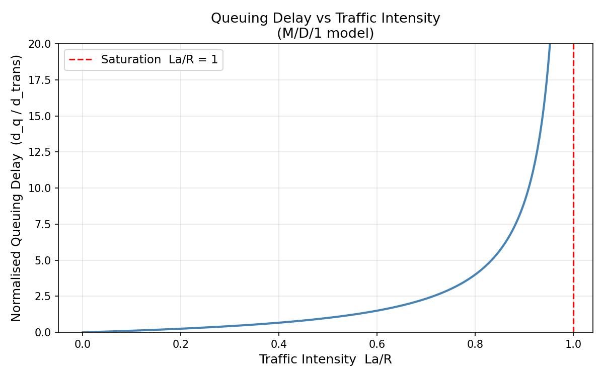

# Topic 1 — Networking Fundamentals

Source: Kurose & Ross, Ch. 1, 3, 4 | Chat discussion

## Theory Covered
- What is a network? Hosts, links, switches, packets
- The TCP/IP protocol stack (5 layers) and encapsulation
- Circuit switching vs packet switching — why the internet chose packets
- The 4 sources of nodal delay: processing, queueing, transmission, propagation
- Traffic intensity `La/R` and why queuing delay explodes near saturation
- TCP: connection-oriented, 3-way handshake, reliability, flow/congestion control
- UDP: connectionless, no guarantees, low overhead
- Why 5G uses UDP (GTP-U) for the user plane tunnel

## Files

| File | What it demonstrates |
|------|----------------------|
| [delay_calculator.py](delay_calculator.py) | Compute all 4 delay components; plot queuing delay vs traffic intensity |
| [tcp_demo.py](tcp_demo.py) | TCP server + client (file download scenario, 3-way handshake) |
| [udp_demo.py](udp_demo.py) | UDP server + client (video stream scenario, simulated packet loss) |
| [encapsulation.py](encapsulation.py) | Layer-by-layer packet encapsulation and decapsulation visualizer |

## How to Run

```bash
cd 00_Networking_Fundamentals
pip install matplotlib numpy   # only needed for delay_calculator.py

python delay_calculator.py     # prints delay breakdown + saves traffic_intensity.png
python tcp_demo.py             # runs TCP server+client in-process
python udp_demo.py             # runs UDP server+client, shows dropped frames
python encapsulation.py        # prints packet structure at each layer
```

## Sample Outputs

**`delay_calculator.py`**



```
=== Nodal Delay Breakdown ===
  Component                     Value
  ------------------------------------
  processing_ms                0.0010 ms
  queueing_ms                288.0000 ms
  transmission_ms             12.0000 ms
  propagation_ms               0.0250 ms
  total_ms                   300.0260 ms
  traffic_intensity            0.9600

=== Queuing Delay at Various Traffic Intensities ===
  arrival=  10 pps  La/R=0.120  →  queueing delay = 1.64 ms
  arrival=  30 pps  La/R=0.360  →  queueing delay = 6.75 ms
  arrival=  50 pps  La/R=0.600  →  queueing delay = 18.00 ms
  arrival=  65 pps  La/R=0.780  →  queueing delay = 42.55 ms
  arrival=  75 pps  La/R=0.900  →  queueing delay = 108.00 ms
  arrival=  80 pps  La/R=0.960  →  queueing delay = 288.00 ms
  arrival=  83 pps  La/R=0.996  →  queueing delay = 2988.00 ms
```

**`tcp_demo.py`**
```
[TCP Server] Listening on 127.0.0.1:9100
[TCP Client] Connected — 3-way handshake complete
[TCP Server] Sent chunk 1: b'NUMPY_BINARY_DATA_NU'
[TCP Server] Sent chunk 2: b'MPY_BINARY_DATA_NUMP'
...
[TCP Server] Sent chunk 9: b'A_NUMPY_BINARY_DATA_'
[TCP Client] File received intact: 180 bytes  ✅
  TCP guarantee: every byte arrived, in order, no duplicates.
```

**`udp_demo.py`**
```
[UDP Client] Sent:  FRAME_00  t=...
[UDP Client] Sent:  FRAME_01  t=...
[UDP Client] Sent:  FRAME_02  t=...
[UDP Client] FRAME_03 — LOST (simulated network drop) ❌
[UDP Client] Sent:  FRAME_04  t=...
...
[UDP Client] FRAME_07 — LOST (simulated network drop) ❌
[UDP Client] Sent:  FRAME_08  t=...
[UDP Client] Received 8/10 frames
[UDP Client] Missing frames [3, 7] were just skipped — stream continued ⚡
  UDP trade-off: no retransmit, no stall.
```

**`encapsulation.py`**
```
=== Packet Encapsulation (Application → Physical) ===

Layer 5 — Application:
    GET / HTTP/1.1  Host: google.com

Layer 4 — Transport:
    [TCP | src=52341 | dst=80 | seq=1000 | flags=SYN-ACK]  GET / HTTP/1.1  Host: google.com

Layer 3 — Network:
    [IP | src=192.168.1.10 | dst=142.250.80.46 | TTL=64 | proto=TCP]  [TCP ...]  GET / ...

Layer 2 — Data Link:
    [ETH | src=AA:BB:CC:DD:EE:FF | dst=11:22:33:44:55:66 | type=IPv4]  [IP ...]  [TCP ...]  GET / ...  [FCS]

Layer 1 — Physical:
    10110010 01101110 00110101 ...  (NRZ encoded bits)
```

## Key Takeaways
- Queueing delay is the only one that blows up — all others are bounded
- TCP adds ~1.5 RTT overhead (handshake) but guarantees every byte arrives
- UDP saves that overhead at the cost of "fire and forget"
- Bandwidth (Hz) ≠ data rate (bps) — Shannon's law bridges them: `C = B × log2(1 + SNR)`
