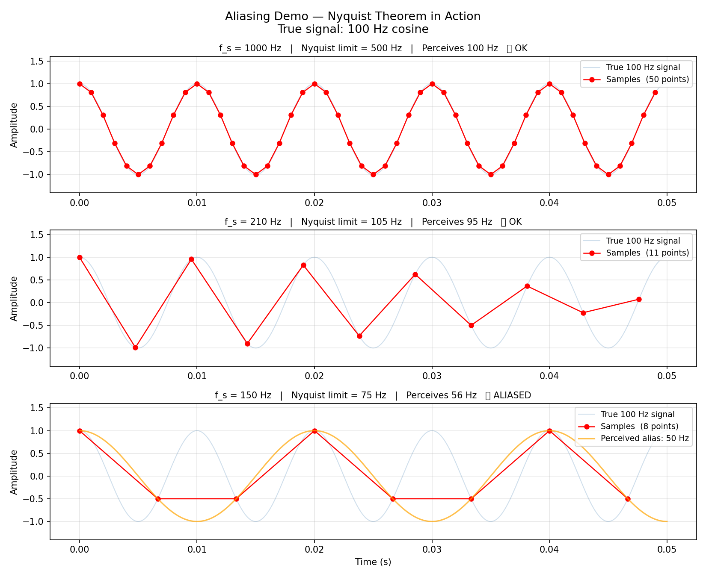
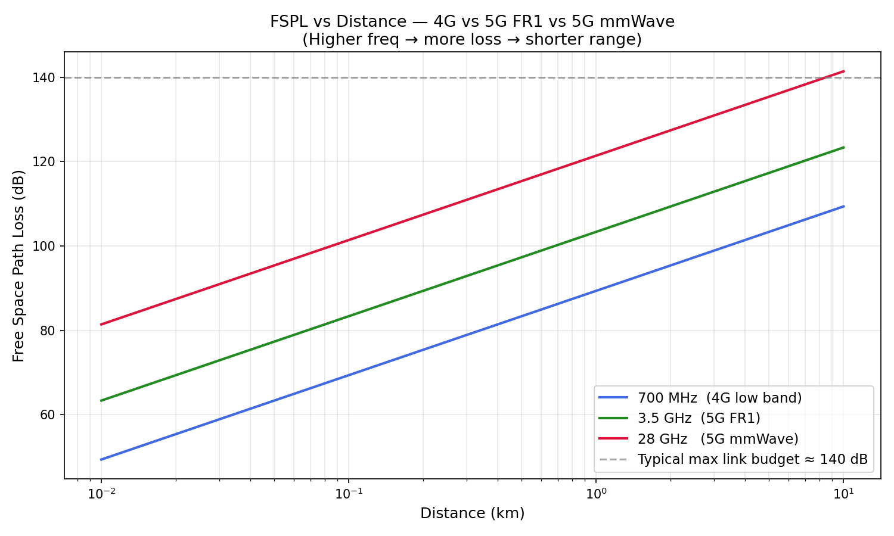
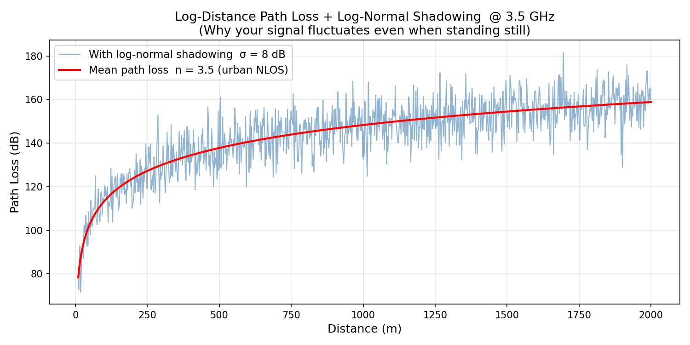

# Signal Fundamentals + DSP

## Topics
- Continuous vs discrete signals
- Fourier Transform & FFT
- Nyquist sampling theorem & aliasing
- FIR filter design (windowed-sinc)
- Spectrogram (STFT)
- RF basics: frequency, wavelength, dB/dBm
- Path loss models, shadowing
- Link budget calculator

## Files — Topic 4: Digital Signal Processing

| File | What it builds |
|------|----------------|
| [fft_basics.py](fft_basics.py) | Composite signal → FFT → recover individual tones with exact amplitudes |
| [aliasing.py](aliasing.py) | Nyquist theorem demo — what happens at 1000 / 210 / 150 Hz sampling of a 100 Hz signal |
| [fir_filter.py](fir_filter.py) | Windowed-sinc FIR LPF from scratch — design, frequency response, apply, verify |
| [spectrogram.py](spectrogram.py) | STFT from scratch — chirp sweep + switching tones, time-frequency resolution tradeoff |

### Plots — Topic 4





### Sample Outputs — Topic 4

**`fft_basics.py`**
```
  Frequency (Hz)    Recovered Amp    True Amp     Error
  -------------------------------------------------------
              50           1.0000      1.0000  8.88e-16
             120           0.5000      0.5000  1.11e-16
             300           0.3000      0.3000  1.67e-16

  Top 3 peaks detected at: [ 50 120 300] Hz  ✅
```

**`aliasing.py`**
```
    f_s (Hz)    Nyquist (Hz)   Nyquist OK?   Perceived freq
  ----------------------------------------------------------
        1000             500             ✅              100
         210             105             ✅              100
         150              75             ❌               50  ← |100 - 1×150| = 50
         120              60             ❌               20  ← |100 - 1×120| = 20
```

**`fir_filter.py`**
```
  Frequency     Input Amp    Output Amp   Attenuation
  ----------------------------------------------------
      50 Hz         1.000        0.9995   PASSED ✅
     200 Hz         0.800        0.0005   BLOCKED ✅

  Sum of all taps : 1.000000  (DC gain = 1)
  Group delay     : 50 samples = 50.0 ms  (linear phase)
```

**`spectrogram.py`**
```
  nperseg    Δt (ms)    Δf (Hz)   Note
  --------------------------------------
       32        8.0       31.2   fine time
      128       32.0        7.8   balanced
      512      128.0        2.0   fine freq

  5G NR OFDM: subcarrier spacing Δf × symbol duration Δt = 1
```

## Files — Topic 2: RF & Wireless Basics

| File | What it demonstrates |
|------|----------------------|
| [rf_basics.py](rf_basics.py) | Frequency ↔ wavelength, dB/dBm conversions, Shannon capacity |
| [path_loss.py](path_loss.py) | FSPL, log-distance model, log-normal shadowing + plots |
| [link_budget.py](link_budget.py) | Full link budget calculator: EIRP → path loss → margin → PASS/FAIL |

## How to Run

```bash
cd 01_Signal_Fundamentals
pip install matplotlib numpy

python rf_basics.py     # frequency/wavelength table, dB conversions, Shannon capacity
python path_loss.py     # path loss models + saves fspl_vs_frequency.png, path_loss_shadowing.png
python link_budget.py   # 3 link budget scenarios: 3.5 GHz, 28 GHz @ 500m, 28 GHz @ 1km
```

## Sample Outputs

**`rf_basics.py`**
```
=== Frequency → Wavelength → Band ===

  Band                              λ (cm)  Category
  700 MHz  (4G low band)       42.86  Sub-3 GHz   (4G / WiFi 2.4 GHz territory)
  2.1 GHz  (4G mid band)       14.29  Sub-3 GHz   (4G / WiFi 2.4 GHz territory)
  3.5 GHz  (5G NR FR1)          8.57  Sub-6 GHz   (5G NR FR1)
  28 GHz   (5G mmWave)          1.07  cmWave      (5G NR FR1 upper / satellite)
  39 GHz   (5G mmWave)          0.77  mmWave      (5G NR FR2 — 28 / 39 GHz)

=== Power Conversions ===
     10.000000 W  →   40.0 dBm
      1.000000 W  →   30.0 dBm
      0.001000 W  →    0.0 dBm
      0.000001 W  →  -30.0 dBm

=== Shannon Capacity: Bandwidth → Data Rate ===
  4G  20 MHz   SNR=20 dB        C =    664.4 Mbps
  5G  100 MHz  SNR=20 dB        C =   3321.9 Mbps
  5G  100 MHz  SNR=30 dB        C =  33219.3 Mbps
  mmWave 400 MHz SNR=30dB       C = 132877.1 Mbps
```

**`path_loss.py`**





```
=== FSPL spot checks ===
  1 km, 700 MHz (4G)              FSPL =  89.4 dB
  1 km, 3.5 GHz (5G FR1)         FSPL = 103.3 dB
  1 km, 28 GHz (mmWave)          FSPL = 121.4 dB

=== Path Loss Exponent (PLE) by Environment [3GPP TR 38.901] ===
  Free space (any frequency)          n = 2.0
  Urban LOS — Sub-6 GHz              n = 2.2
  Urban LOS — mmWave 28 GHz          n = 2.1
  Urban NLOS — Sub-6 GHz             n = 3.5
  Urban NLOS — mmWave 28 GHz         n = 4.0
  Indoor — Sub-6 GHz                 n = 3.0
  Indoor — mmWave 28 GHz             n = 5.5
```

**`link_budget.py`**
```
======================================================
  5G NR — 3.5 GHz  |  500 m  |  urban NLOS
======================================================
  EIRP (dBm)                     58
  Path Loss (dB)                 107.8
  Rx Power (dBm)                 -52.8
  Rx Sensitivity (dBm)           -77.0
  Link Margin (dB)               24.2
  Result                         PASS ✅

======================================================
  5G NR mmWave — 28 GHz  |  200 m  |  LOS
======================================================
  EIRP (dBm)                     68
  Path Loss (dB)                 107.41
  Rx Power (dBm)                 -32.41
  Rx Sensitivity (dBm)           -67.98
  Link Margin (dB)               35.57
  Result                         PASS ✅

======================================================
  5G NR mmWave — 28 GHz  |  300 m  |  outdoor-to-indoor NLOS
======================================================
  EIRP (dBm)                     68
  Path Loss (dB)                 125.25
  Rx Power (dBm)                 -77.25
  Rx Sensitivity (dBm)           -67.98
  Link Margin (dB)               -9.27
  Result                         FAIL ❌
```

## Key Takeaways
- Higher frequency → shorter wavelength → more spectrum available → wider bandwidth → more capacity
- FSPL increases 6 dB every time you double distance OR double frequency
- PLE ≈ 2 in LOS (regardless of frequency); NLOS mmWave PLE can reach 4–6
- Link margin = Rx Power − Rx Sensitivity; must be > 0 for the link to work
- mmWave needs beamforming (high antenna gain) to compensate for its severe path loss
