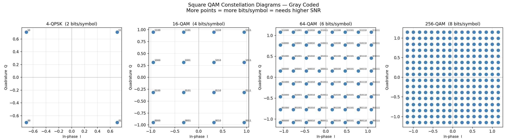
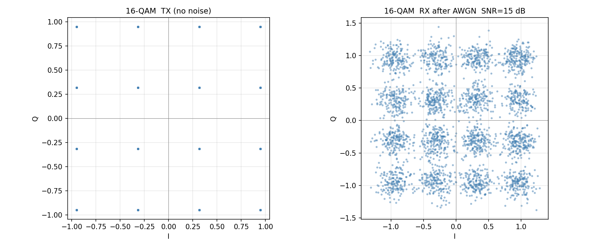
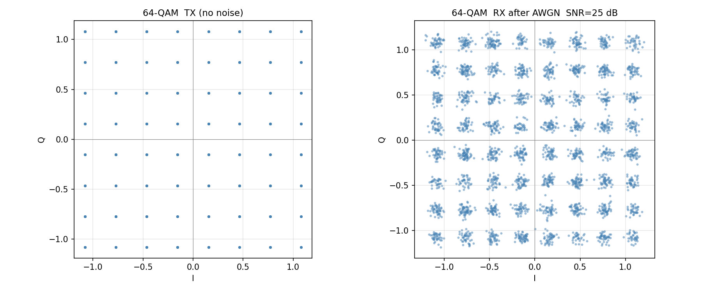
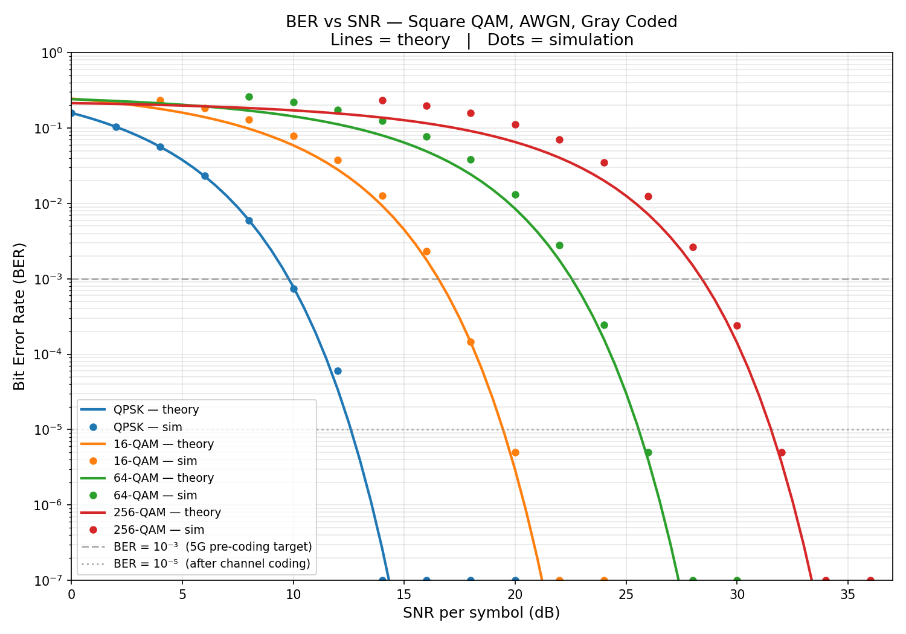
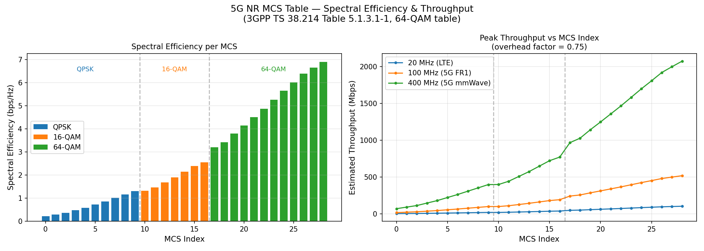

# Topic 3 — Modulation Schemes


## Theory Covered
- What modulation is: varying amplitude / frequency / phase of a carrier
- The IQ plane (constellation diagram) — the "city map" of symbols
- Gray coding — adjacent points differ by exactly 1 bit
- Square M-QAM: 4 / 16 / 64 / 256 points, each carrying log₂(M) bits
- BER vs SNR tradeoff: more points = more bits/symbol but needs higher SNR
- Adaptive Modulation & Coding (AMC): 5G picks MCS dynamically from CQI

## Files

| File | What it builds |
|------|----------------|
| [constellation.py](constellation.py) | Gray code, IQ grid generation, normalisation, plots all 4 constellations |
| [transceiver.py](transceiver.py) | Full TX → AWGN channel → min-distance RX pipeline, step-by-step BER trace |
| [ber_curves.py](ber_curves.py) | Theoretical BER formula + simulation overlay, SNR thresholds per scheme |
| [mcs_table.py](mcs_table.py) | 5G NR MCS table (38.214), spectral efficiency bar chart, AMC decision demo |

## How to Run

```bash
cd 02_Modulation_Techniques
pip install numpy matplotlib   # scipy not required

python3 constellation.py   # Gray code walkthrough + saves constellations.png
python3 transceiver.py     # TX/RX trace + noisy scatter plots
python3 ber_curves.py      # BER table + saves ber_curves.png
python3 mcs_table.py       # MCS table + AMC demo + saves mcs_table.png
```

## Plots

### Constellation Diagrams


### Noisy Reception — 16-QAM at SNR = 15 dB


### Noisy Reception — 64-QAM at SNR = 25 dB


### BER vs SNR (theory + simulation)


### 5G NR MCS Table — Spectral Efficiency & Throughput


## Sample Outputs

**`constellation.py`**
```
=== Gray Code — why neighbours differ by 1 bit ===

  1-bit Gray code: 0  1
  2-bit Gray code: 00  01  11  10
  3-bit Gray code: 000  001  011  010  110  111  101  100

=== Bits per symbol vs constellation size ===

       M    bits/sym    Avg Power (norm)
  --------------------------------------
       4           2              1.0000
      16           4              1.0000
      64           6              1.0000
     256           8              1.0000

  Average power = 1.0 for all — normalisation confirmed.
```

**`transceiver.py`** — step-by-step trace (16-QAM, SNR = 15 dB)
```
  TX bits     TX (I,Q)              RX (I,Q)          RX bits   OK?
  --------------------------------------------------------------------
  0010      (+0.316,-0.949)    (+0.085,-1.141)    0010        ✅
  0011      (+0.949,-0.949)    (+0.919,-1.009)    0011        ✅
  1001      (-0.316,+0.316)    (-0.476,+0.193)    1001        ✅
  0111      (+0.949,-0.316)    (+0.632,-0.320)    0110        ❌  ← noise shifted it
  0001      (-0.316,-0.949)    (-0.302,-0.963)    0001        ✅
```

**`ber_curves.py`**
```
=== SNR required to achieve BER = 10⁻³ ===

  Scheme      bits/sym     Required SNR (dB)
  ------------------------------------------
  QPSK               2                   9.8
  16-QAM             4                  16.5
  64-QAM             6                  22.5
  256-QAM            8                  28.4

  Each step up costs ~6–7 dB more SNR but adds 2 bits/symbol.
```

**`mcs_table.py`** — AMC decision
```
  Measured SNR   Best MCS   Modulation    SE        ~Tput @100MHz
  ---------------------------------------------------------------
        -5 dB          0      QPSK      0.2344        17.6 Mbps
         0 dB          2      QPSK      0.3770        28.3 Mbps
        10 dB          8      QPSK      1.1758        88.2 Mbps
        15 dB         12    16-QAM      1.6953       127.1 Mbps
        20 dB         16    16-QAM      2.5703       192.8 Mbps
        25 dB         19    64-QAM      3.8086       285.6 Mbps
        30 dB         23    64-QAM      5.2734       395.5 Mbps
        35 dB         27    64-QAM      6.6602       499.5 Mbps
```

## Key Takeaways
- Every symbol is a point on the IQ plane; the receiver finds the nearest one
- Gray coding limits a noise-induced symbol error to 1 bit wrong instead of many
- Higher-order QAM doubles bits/symbol but costs ~6–7 dB more SNR each step
- 5G NR switches MCS every ~10 ms based on the UE's reported CQI
- 256-QAM (max in 5G NR) only activates when you're close to the tower with a clean signal
