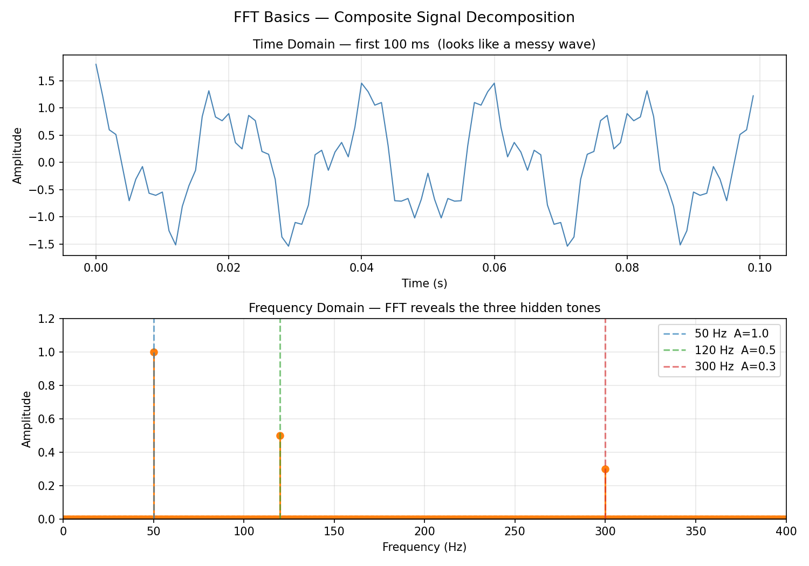
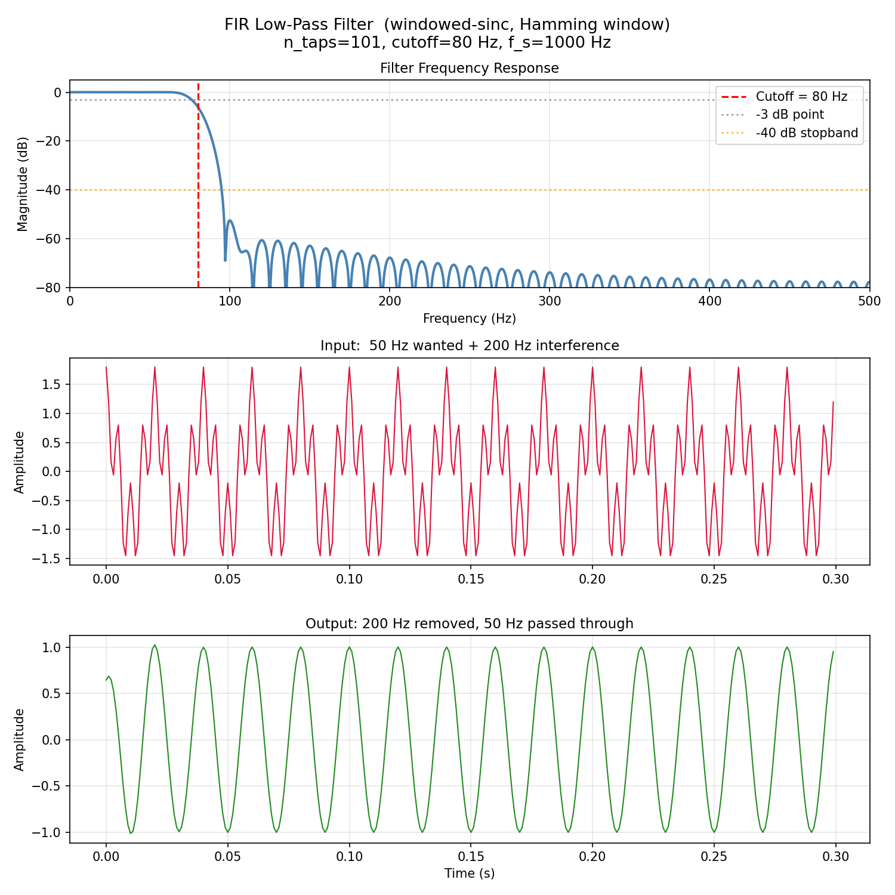
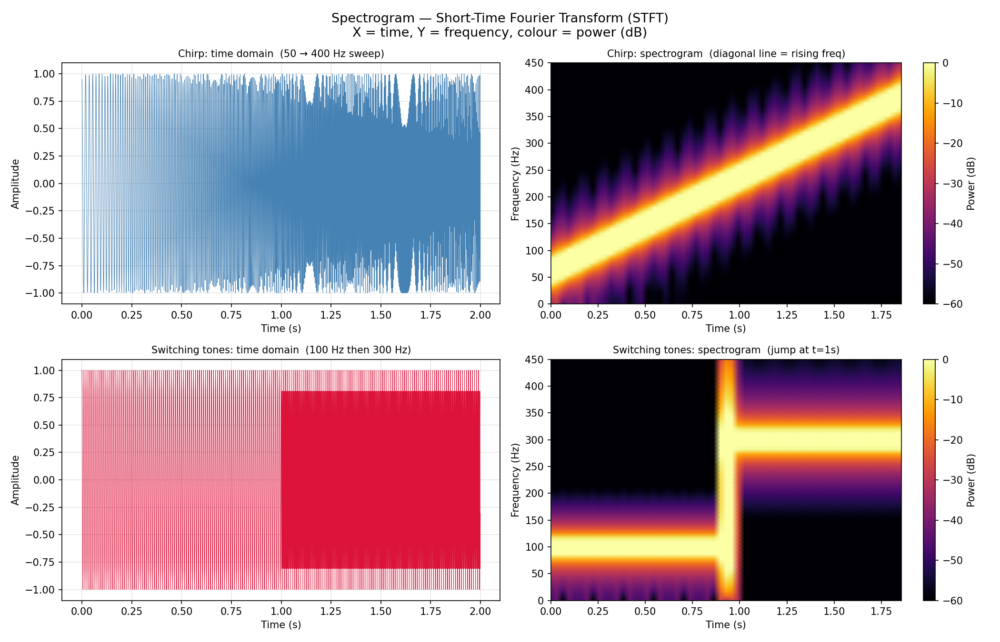

# Topic 4 — Digital Signal Processing

Source: Downey's Think DSP, Ch. 1–4 |

## Theory Covered
- Time domain vs frequency domain — two views of the same signal
- Fourier Transform & FFT: decompose any signal into sinusoids
- Nyquist-Shannon theorem: f_s ≥ 2·f_max or aliasing occurs
- FIR filter design: windowed-sinc method, Hamming window
- Spectrogram (STFT): frequency content over time

## Files

| File | What it builds |
|------|----------------|
| [fft_basics.py](fft_basics.py) | Composite signal → FFT → recover individual tones with exact amplitudes |
| [aliasing.py](aliasing.py) | Nyquist demo — same 100 Hz signal sampled at 1000 / 210 / 150 Hz |
| [fir_filter.py](fir_filter.py) | Windowed-sinc LPF from scratch — design, frequency response, verify |
| [spectrogram.py](spectrogram.py) | STFT from scratch — chirp sweep + switching tones, resolution tradeoff |

## How to Run

```bash
cd 03_DSP
pip install numpy matplotlib   # no scipy needed — all implemented from scratch

python3 fft_basics.py    # FFT decomposition + saves fft_basics.png
python3 aliasing.py      # aliasing demo + saves aliasing.png
python3 fir_filter.py    # FIR filter + saves fir_filter.png
python3 spectrogram.py   # spectrogram + saves spectrogram.png
```

## Plots

### FFT — Composite Signal Decomposition


### Aliasing — Nyquist Theorem in Action


### FIR Low-Pass Filter


### Spectrogram (STFT)


## Sample Outputs

**`fft_basics.py`**
```
  Frequency (Hz)    Recovered Amp    True Amp     Error
  -------------------------------------------------------
              50           1.0000      1.0000  8.88e-16
             120           0.5000      0.5000  1.11e-16
             300           0.3000      0.3000  1.67e-16

  Top 3 peaks detected at: [ 50 120 300] Hz  ✅
  Key insight: the FFT perfectly separated three overlapping waves.
  In 5G, the same operation separates hundreds of OFDM subcarriers.
```

**`aliasing.py`**
```
    f_s (Hz)    Nyquist (Hz)   Nyquist OK?   Perceived freq
  ----------------------------------------------------------
        1000             500             ✅              100
         210             105             ✅              100
         150              75             ❌               50  ← |100 - 1×150| = 50
         120              60             ❌               20  ← |100 - 1×120| = 20

  5G NR: a 100 MHz channel requires ADC ≥ 200 Msps.
```

**`fir_filter.py`**
```
  Frequency     Input Amp    Output Amp   Attenuation
  ----------------------------------------------------
      50 Hz         1.000        0.9995   PASSED ✅
     200 Hz         0.800        0.0005   BLOCKED ✅

  Sum of all taps : 1.000000  (DC gain = 1)
  Group delay     : 50 samples = 50.0 ms  (linear phase)
```

**`spectrogram.py`**
```
  nperseg    Δt (ms)    Δf (Hz)   Note
  --------------------------------------
       32        8.0       31.2   fine time resolution
      128       32.0        7.8   balanced
      512      128.0        2.0   fine frequency resolution

  5G NR OFDM: subcarrier spacing Δf × symbol duration Δt = 1
  Same tradeoff: wider subcarriers = shorter symbols = better for mobility.
```

## Key Takeaways
- FFT decomposes a messy signal into its exact frequency components — the basis of all OFDM receivers
- Nyquist: sample below 2× the signal frequency and you get aliasing (phantom frequencies)
- FIR filter = weighted average of recent input samples; weights are the windowed-sinc coefficients
- Spectrogram = FFT through a sliding window; trades time resolution for frequency resolution
- These four operations are the core DSP toolkit used in every 5G modem
