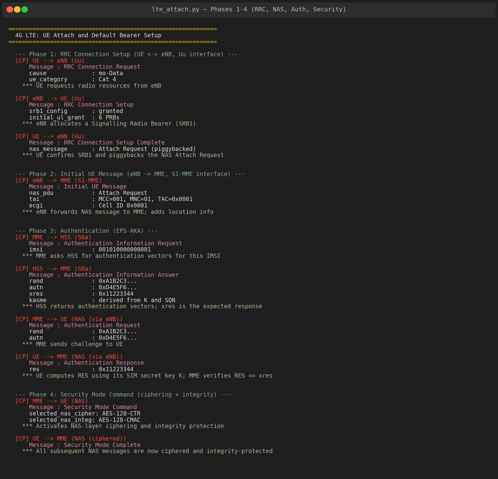
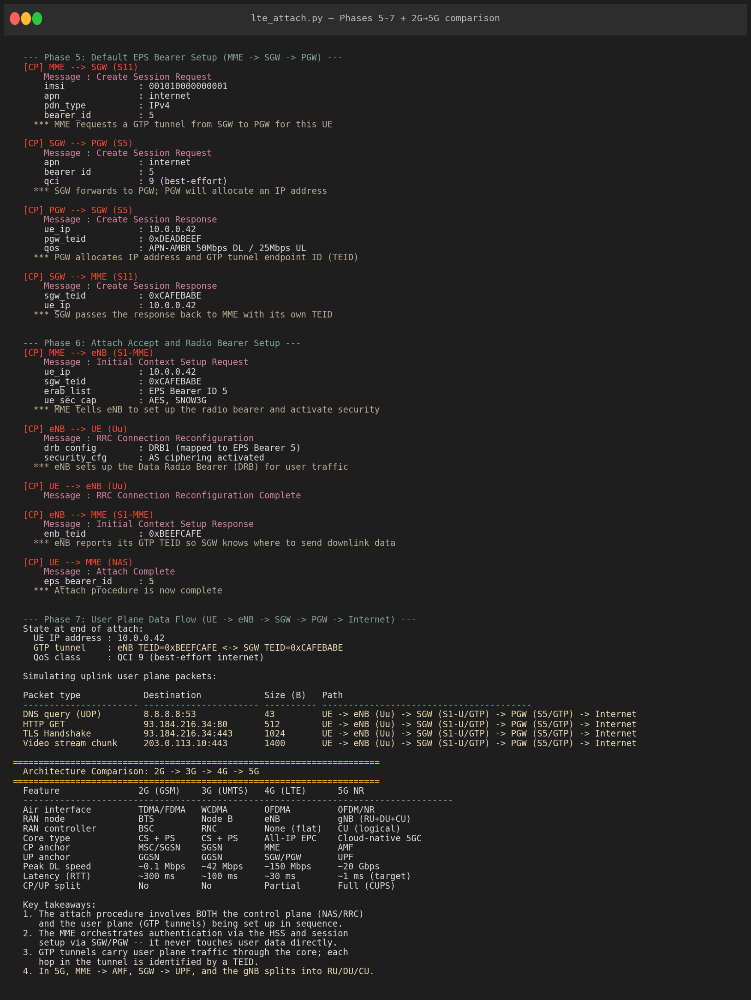
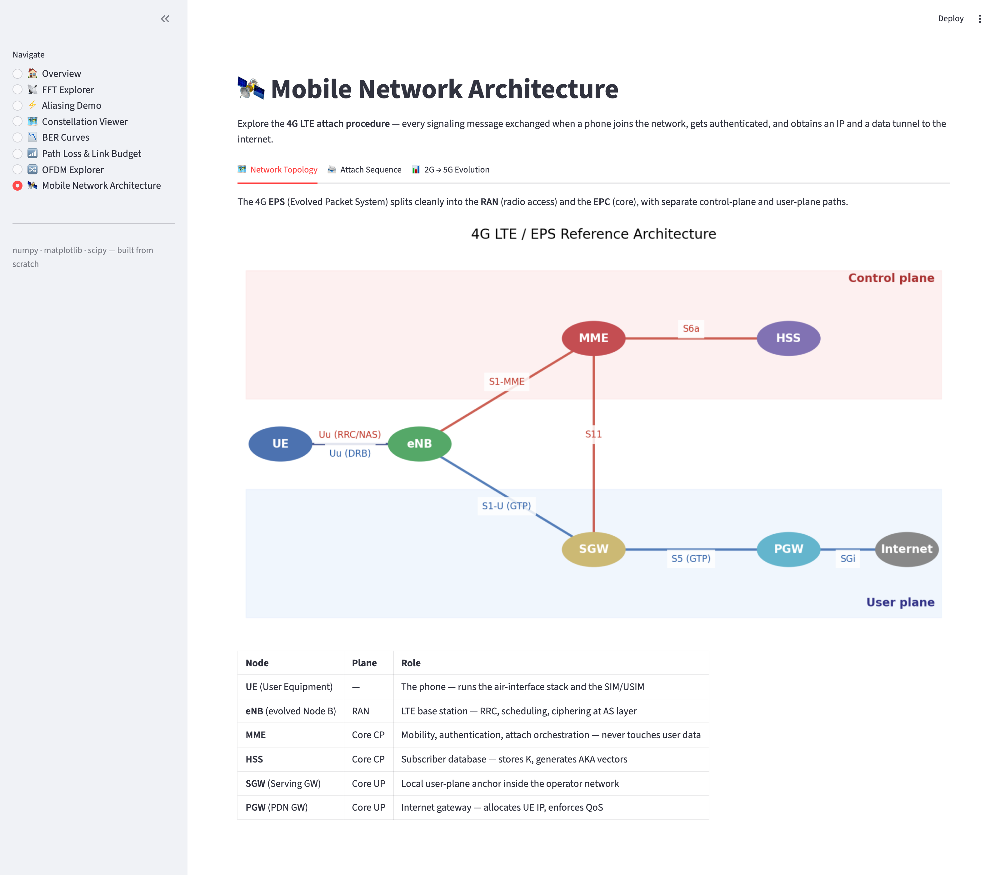
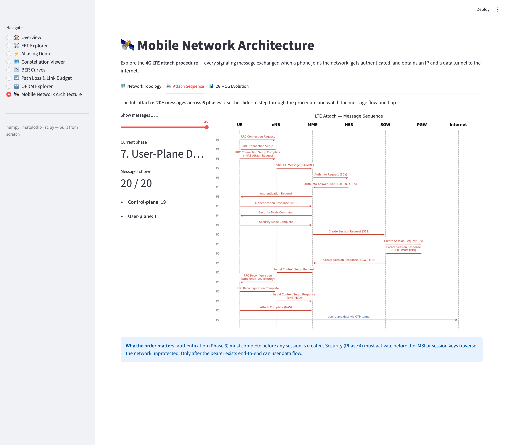
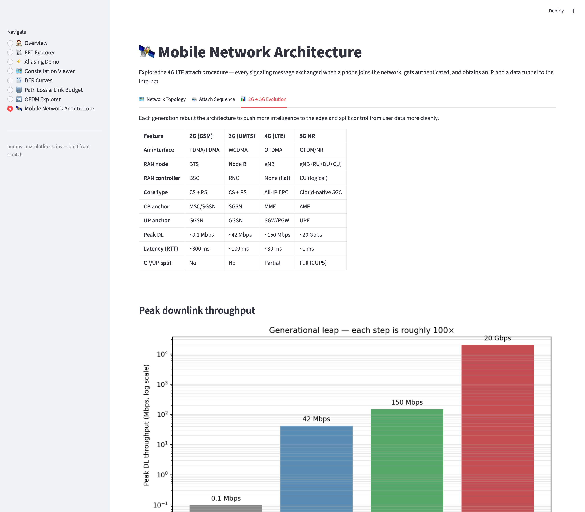

# 05 — Mobile Network Architecture (Phase 2 · Topic 1)

End-to-end simulation of the **4G LTE attach procedure** — the message exchange that happens when a phone powers on and joins the network, gets authenticated, and is given an IP address and a data tunnel to the internet.

## Files

| File | Purpose |
|------|---------|
| [`lte_attach.py`](lte_attach.py) | Replays the full attach procedure with annotated control-plane / user-plane traces |

## Run

```bash
python3 lte_attach.py
```

## Concepts

### What the simulator covers

| Phase | Procedure | Interfaces |
|-------|-----------|------------|
| 1 | RRC Connection Setup (UE ↔ eNB) | Uu |
| 2 | Initial UE Message (eNB → MME) | S1-MME |
| 3 | EPS-AKA Authentication (MME ↔ HSS ↔ UE) | S6a, NAS |
| 4 | NAS Security Mode Command | NAS |
| 5 | Default EPS Bearer setup (MME → SGW → PGW) | S11, S5 |
| 6 | Initial Context Setup + RRC Reconfiguration | S1-MME, Uu |
| 7 | User-plane data flow over GTP tunnels | S1-U, S5 |

### Network nodes modeled

| Node | Plane | Role |
|------|-------|------|
| **UE** | — | User Equipment (the phone) |
| **eNB** | RAN | LTE base station |
| **MME** | Core control | Mobility, attach, authentication orchestration |
| **HSS** | Core control | Subscriber database, AKA vectors |
| **SGW** | Core user | User-plane anchor inside the operator network |
| **PGW** | Core user | Internet gateway, IP allocation |

### Key concepts demonstrated

- **Control plane vs user plane** — NAS/RRC messages set up state; GTP tunnels carry user data
- **GTP tunnel endpoints (TEIDs)** — how each hop in the tunnel is addressed
- **EPS-AKA** — challenge/response authentication using the SIM's secret key K
- **NAS security** — ciphering and integrity protection for signaling
- **EPS bearers** — how QoS classes (QCI) get mapped from the core down to the radio (DRB)

The script also prints a side-by-side **2G → 3G → 4G → 5G** architecture comparison showing how RAN nodes, core anchors, and CP/UP split evolved across generations.

---

## Output (script run)

The script prints a phase-by-phase trace of every message exchanged during the attach. Each line shows the source, destination, interface, payload, and a one-line explanation of *why* the message exists.

### Phases 1–4: radio link, attach request, authentication, security



### Phases 5–7 + 2G→5G evolution table



**End state** after the attach completes:
- UE IP address: `10.0.0.42` (allocated by PGW)
- GTP tunnel: `eNB TEID=0xBEEFCAFE` ↔ `SGW TEID=0xCAFEBABE`
- QoS class: QCI 9 (best-effort internet)

---

## Interactive dashboard

The same procedure is also explorable in [`../app.py`](../app.py) under the **🛰️ Mobile Network Architecture** page. Three tabs:

### 1. Network topology
Reference architecture diagram with control-plane (red) and user-plane (blue) interfaces clearly labeled.



### 2. Attach sequence
Slider-driven message-sequence chart — drag through all 20 messages and watch the protocol build up phase by phase.



### 3. 2G → 5G evolution
Generation-by-generation comparison plus a log-scale bar chart of peak DL throughput showing the ~100× leap per generation.



```bash
streamlit run ../app.py
```
