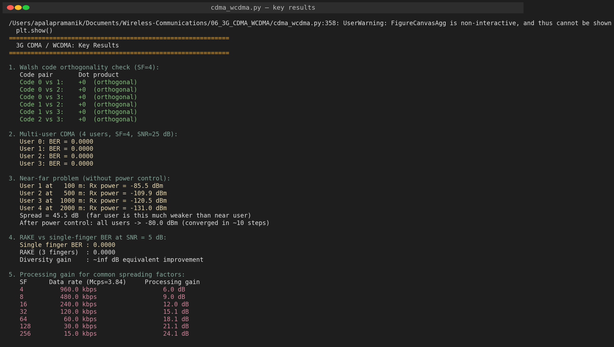
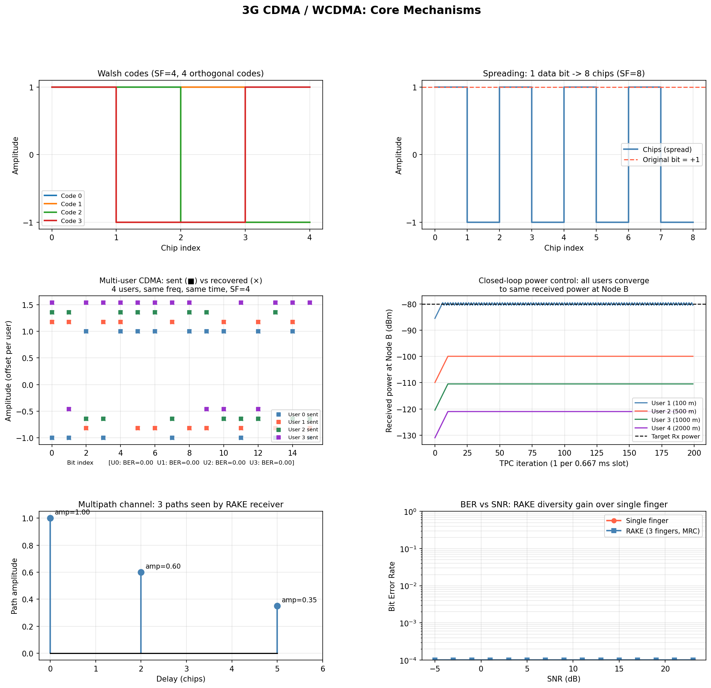
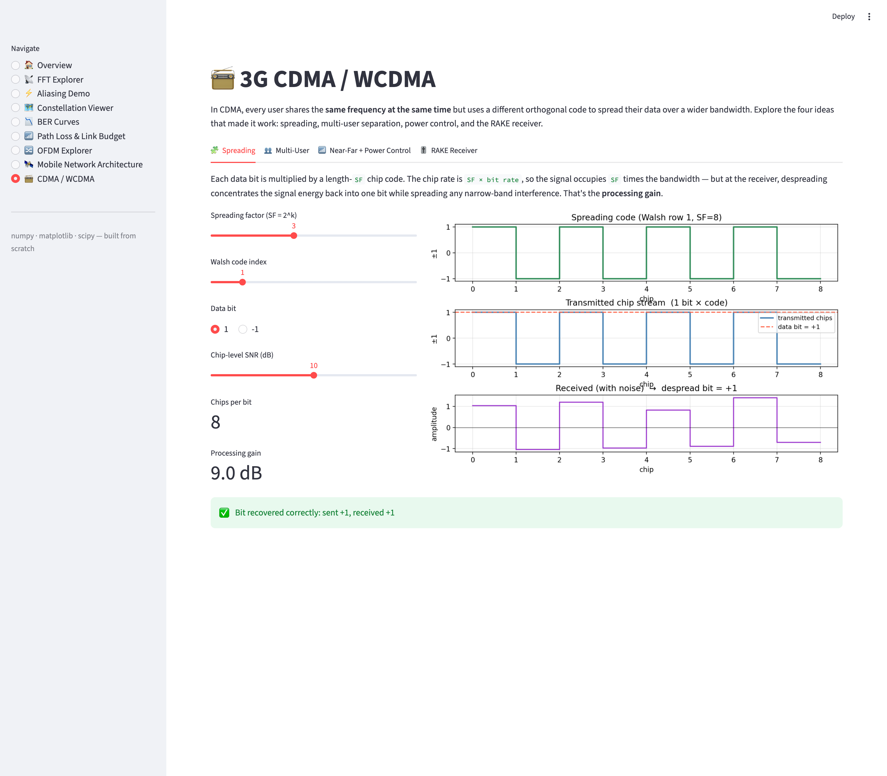
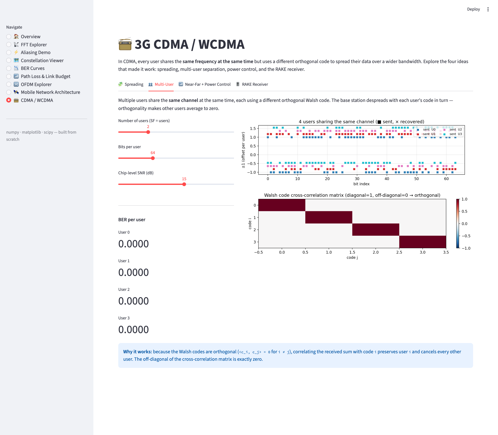
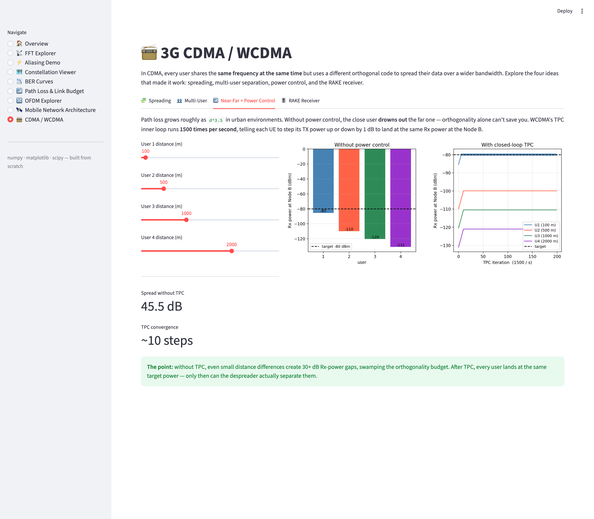
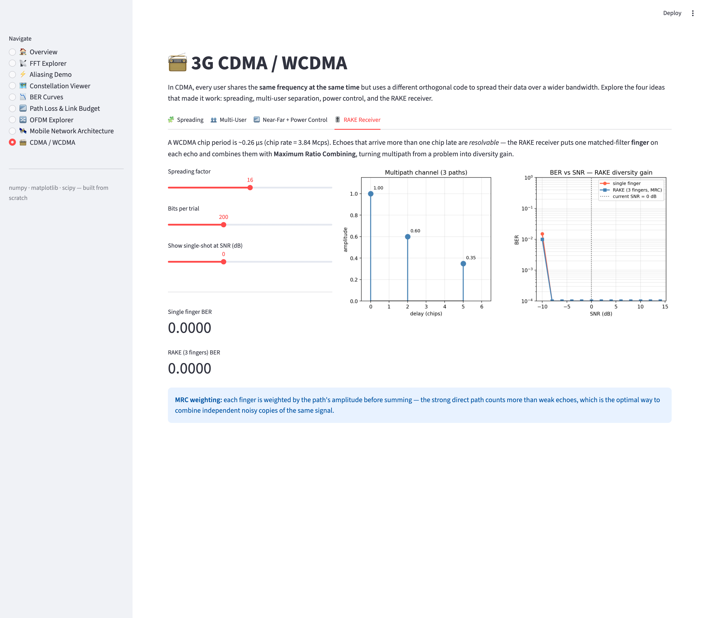

# 06 — 3G CDMA / WCDMA (Phase 2 · Topic 2)

CDMA is the 3G air interface trick that lets every user transmit on the **same frequency at the same time** — separation is achieved by giving each user a different orthogonal spreading code. This module simulates the four ideas that make it actually work: spreading, multi-user separation, the near-far problem, closed-loop power control, and the RAKE receiver.

## Files

| File | Purpose |
|------|---------|
| [`cdma_wcdma.py`](cdma_wcdma.py) | Full simulator: Walsh codes, multi-user link, near-far + TPC, RAKE BER curve |

## Run

```bash
python3 cdma_wcdma.py
```

Outputs `phase2_topic2_cdma_wcdma.png` (six-panel summary plot) and prints the key results to stdout.

---

## Concepts

### 1. Spreading and despreading

Each data bit is multiplied by a length-`SF` chip code (Walsh-Hadamard). The chip rate is `SF × bit rate`, so the signal occupies `SF` times the bandwidth. At the receiver, despreading correlates with the same code — concentrating the signal energy back into one bit while spreading any narrow-band interference. That energy-concentration effect is the **processing gain**, equal to `10·log₁₀(SF) dB`.

| SF | Data rate (Mcps = 3.84) | Processing gain |
|----|------------------------|-----------------|
| 4   | 960 kbps | 6.0 dB  |
| 16  | 240 kbps | 12.0 dB |
| 64  | 60 kbps  | 18.1 dB |
| 256 | 15 kbps  | 24.1 dB |

### 2. Multi-user CDMA via Walsh codes

Walsh-Hadamard codes are pairwise orthogonal: `<c_i, c_j> = 0` for `i ≠ j`. So when `N` users transmit `Σ b_u · c_u + noise`, correlating the sum with code `i` cancels every other user out and leaves user `i` intact. The simulator confirms BER = 0 for all 4 users at 25 dB SNR.

### 3. The near-far problem

Path loss in urban environments grows as roughly `d^3.5`. A user at 100 m is received **45 dB stronger** than a user at 2000 m — far more than orthogonal codes can tolerate against quantization, frequency offset, and multipath leakage. Without compensation, the close user drowns out the far one entirely.

### 4. Closed-loop power control

WCDMA's TPC inner loop runs **1500 times per second** (one command per 0.667 ms slot). Each command tells the UE to step its TX power up or down by 1 dB until it lands at the same Rx power at the Node B. The simulator shows convergence within ~10 steps regardless of starting distance.

### 5. RAKE receiver

A WCDMA chip period is ~0.26 µs (chip rate = 3.84 Mcps). Echoes that arrive **more than one chip late** are *resolvable* and become independent diversity branches. The RAKE receiver places one matched-filter **finger** on each echo and combines them with **Maximum Ratio Combining** (each finger weighted by its path's amplitude). Multipath turns from a problem into a diversity gain.

---

## Output (script run)

### Console summary



### Six-panel summary plot



The panels show, clockwise from top-left:

1. **Walsh codes** for SF=4 — four orthogonal chip sequences
2. **Spreading** — one data bit becomes 8 chips
3. **Multi-user CDMA** — 4 users on the same channel, sent (■) vs recovered (×)
4. **Power control convergence** — 4 users at distances 100/500/1000/2000 m all settle at −80 dBm
5. **Multipath channel** — three paths at delays 0, 2, 5 chips with amplitudes 1.0, 0.6, 0.35
6. **RAKE BER vs SNR** — diversity gain from combining the three paths

---

## Interactive dashboard

The same simulator is also explorable in [`../app.py`](../app.py) under the **📻 CDMA / WCDMA** page. Four tabs:

### 1. Spreading
Pick `SF`, a Walsh code index, and a data bit. Watch the chip stream get noisy and despread back to the original bit.



### 2. Multi-user
Drag the user-count slider (2 / 4 / 8 / 16 / 32 users). The cross-correlation matrix on the right confirms orthogonality — diagonal hot, off-diagonal exactly zero.



### 3. Near-far + power control
Independently set 4 user distances. The left bar chart shows the raw 30+ dB Rx-power spread without TPC; the right plot shows them all converging to the target after the closed-loop control kicks in.



### 4. RAKE receiver
Tune SF and bits per trial; the BER vs SNR sweep updates with the diversity gap between a single-finger receiver and the 3-finger RAKE.



```bash
streamlit run ../app.py
```

---

## Key formulas

| Formula | Meaning |
|---------|---------|
| `chips = bit × code` | Spread one data bit into SF chips |
| `b̂ = sign(<rx, code>)` | Despread by correlating with the same code |
| `PG = 10·log₁₀(SF)` | Processing gain in dB |
| `MRC: y = Σ a_k · y_k` | Maximum Ratio Combining across RAKE fingers |
| `PL ≈ (4πd f / c)^n`,  `n ≈ 3.5` | Urban path loss model used in the near-far panel |
