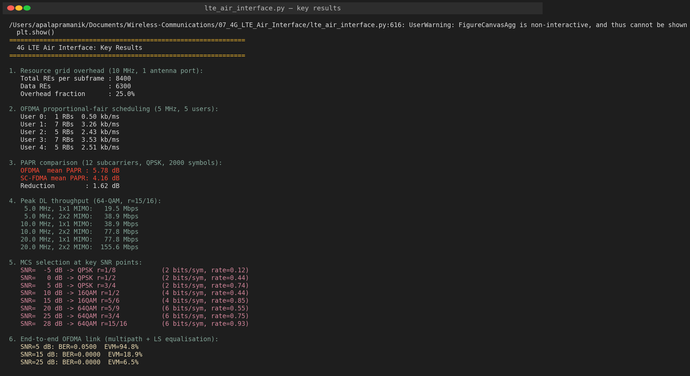
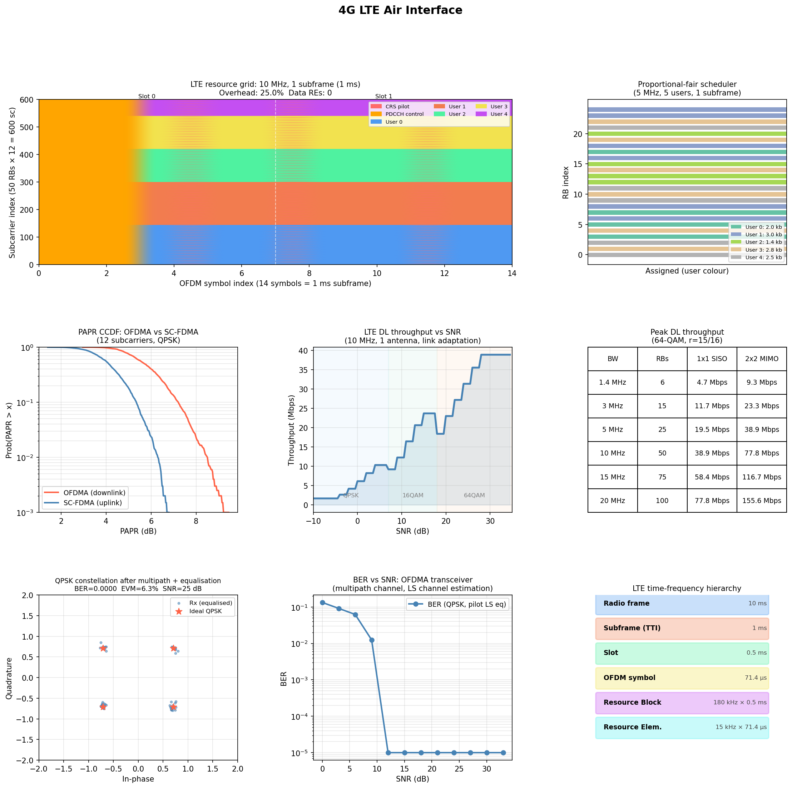
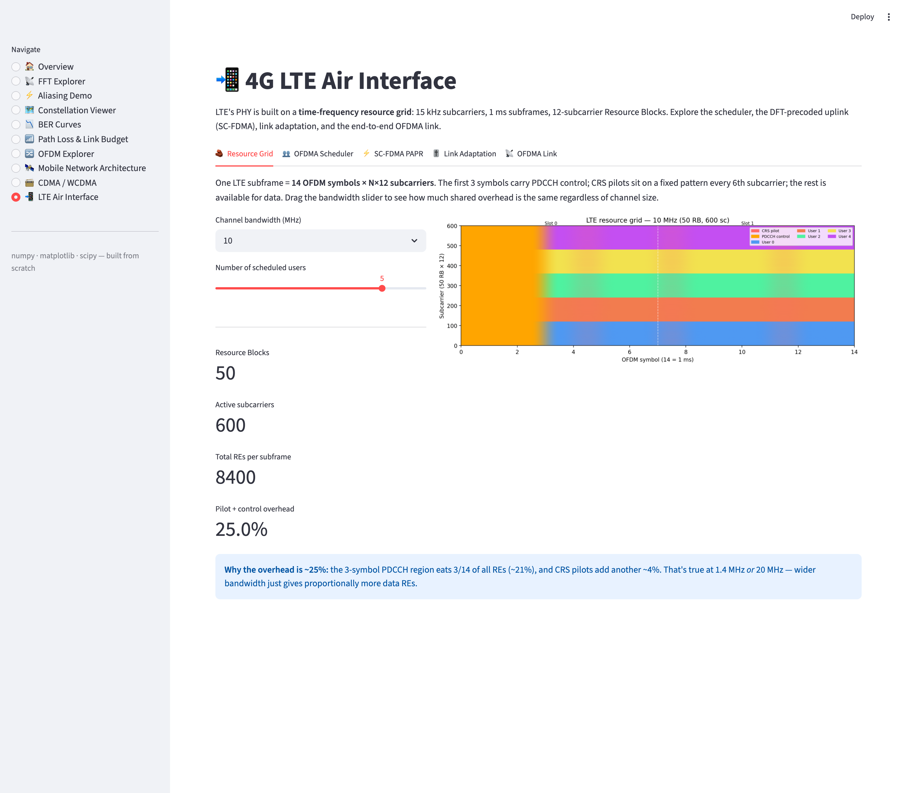
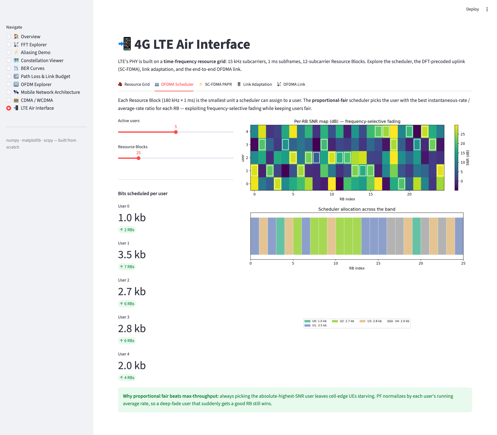
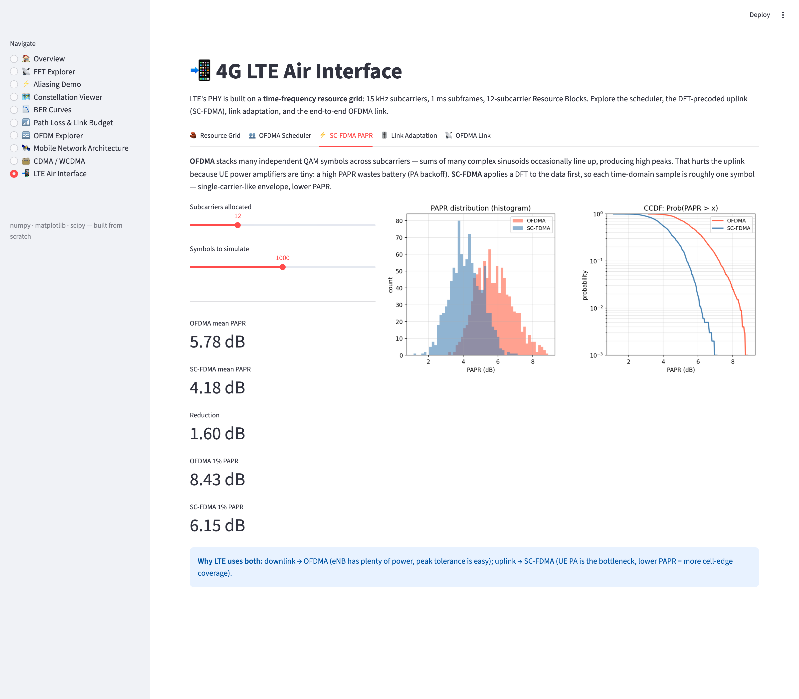
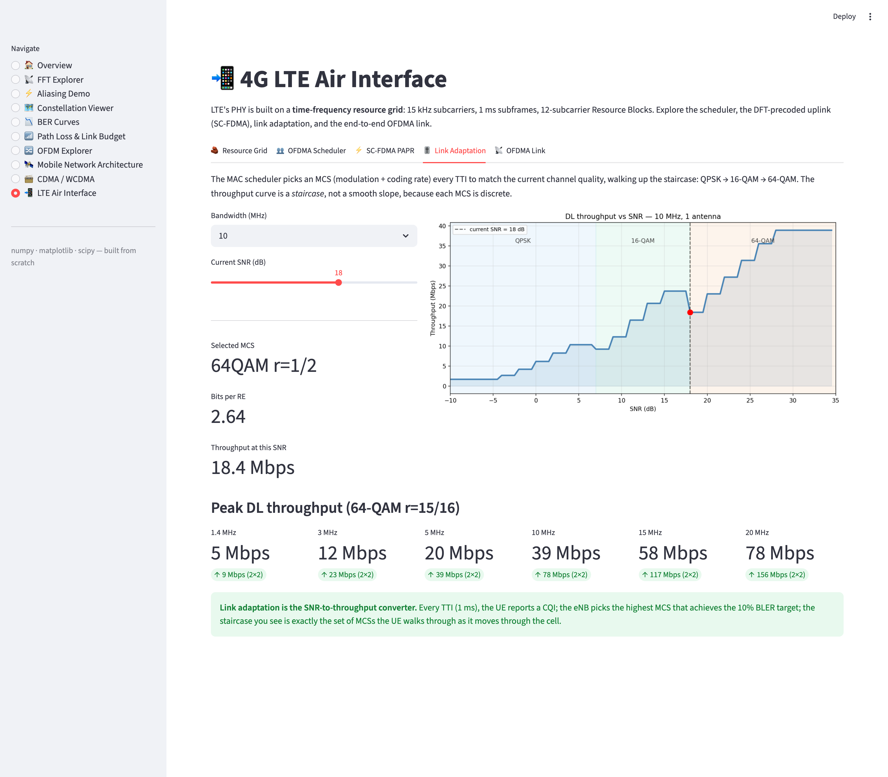
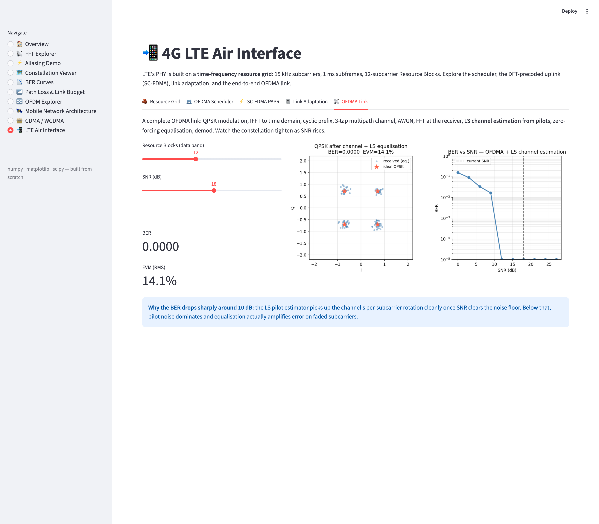

# 07 — 4G LTE Air Interface (Phase 2 · Topic 3)

LTE's PHY layer is built on a **time-frequency resource grid**: 15 kHz subcarriers and 1 ms subframes, organised into 12-subcarrier Resource Blocks. This module simulates the five mechanisms that turn that grid into a working air interface: per-RB scheduling, the DFT-precoded SC-FDMA uplink, link adaptation across the MCS staircase, peak throughput accounting, and an end-to-end OFDMA link with pilot-based channel estimation.

## Files

| File | Purpose |
|------|---------|
| [`lte_air_interface.py`](lte_air_interface.py) | Full simulator — resource grid, OFDMA scheduler, PAPR, MCS, transceiver |

## Run

```bash
python3 lte_air_interface.py
```

Outputs `phase2_topic3_lte_air_interface.png` (eight-panel summary) and prints key results to stdout.

---

## Concepts

### 1. The resource grid

| Element | Size |
|---------|------|
| Radio frame | 10 ms |
| Subframe (TTI) | 1 ms |
| Slot | 0.5 ms |
| OFDM symbol | 71.4 µs (66.7 µs useful + 4.7 µs CP) |
| Subcarrier spacing | 15 kHz |
| Resource Block (RB) | 12 subcarriers × 1 slot = 180 kHz × 0.5 ms |
| Resource Element (RE) | 1 subcarrier × 1 symbol |

The first 3 symbols carry **PDCCH** (control). Cell-specific reference signals (CRS) sit on a fixed pattern: every 6th subcarrier on symbols 0, 4, 7, 11. Net overhead: **~25%** regardless of channel bandwidth.

### 2. OFDMA scheduling

The eNB MAC scheduler allocates RBs every 1 ms. The simulator implements **proportional-fair**:

```
metric_u_rb = instantaneous_rate(u, rb) / running_average_rate(u)
winner(rb)  = argmax_u  metric_u_rb
```

Picking max-throughput would starve cell-edge UEs; normalising by each user's average rate lets them claim RBs on which they're temporarily strong even if their long-term rate is poor.

### 3. SC-FDMA vs OFDMA — PAPR

OFDMA stacks `N_active` independent QAM symbols across subcarriers. The time-domain signal is a sum of many complex sinusoids — they occasionally align, creating high **peak-to-average power ratio** (PAPR) of ~6–10 dB.

**SC-FDMA** (DFT-spread OFDM) precodes the QAM symbols with an `M`-point DFT *before* mapping to subcarriers. Each time-domain sample is then approximately one QAM symbol, so the envelope behaves more like single-carrier — PAPR drops by ~1.5–3 dB.

That's why **LTE downlink = OFDMA** (eNB has plenty of power) and **LTE uplink = SC-FDMA** (UE PA backoff costs battery and cell-edge coverage).

### 4. Link adaptation across the MCS table

17 entries: QPSK (r=1/8 … 3/4), 16-QAM (r=1/3 … 5/6), 64-QAM (r=1/2 … 15/16). The eNB picks the highest MCS where the predicted BLER ≤ 10%. The throughput-vs-SNR curve is a **staircase**:

| SNR | MCS chosen | Bits / RE |
|-----|-----------|-----------|
| −5 dB | QPSK r=1/8 | 0.24 |
| 0 dB  | QPSK r=1/2 | 0.88 |
| 10 dB | 16-QAM r=1/2 | 1.76 |
| 20 dB | 64-QAM r=5/9 | 3.30 |
| 28 dB | 64-QAM r=15/16 | 5.58 |

### 5. Peak DL throughput

```
peak = n_RB × 12 × 14 × (1 − overhead) × bits_per_RE × n_layers × 1 ms⁻¹
```

| BW | RBs | 1×1 SISO | 2×2 MIMO |
|----|-----|----------|----------|
| 5 MHz   | 25  | 19.5 Mbps  | 38.9 Mbps |
| 10 MHz  | 50  | 38.9 Mbps  | 77.8 Mbps |
| 20 MHz  | 100 | 77.8 Mbps  | 155.6 Mbps |

That ~155 Mbps is the LTE Category 4 peak — what every "150 Mbps LTE" marketing slide is quoting.

### 6. End-to-end OFDMA link

```
Tx :  QPSK → place on subcarriers → IFFT → add CP
Ch :  3-tap multipath h[n] + AWGN
Rx :  strip CP → FFT → LS channel estimate at pilots → interp → ZF equalise → demod
```

At SNR ≥ 15 dB the pilot estimate is clean enough that BER drops below 10⁻⁴. Below ~8 dB the pilot noise itself becomes the limiting factor.

---

## Output (script run)

### Console summary



### Eight-panel summary plot



Top row: resource grid for 10 MHz with 5 users colour-coded · proportional-fair RB allocation
Middle row: PAPR CCDF showing the SC-FDMA gap · throughput staircase across SNR · peak throughput table
Bottom row: QPSK constellation after equalisation · BER vs SNR for the full link · LTE time-frequency hierarchy

---

## Interactive dashboard

The same simulator is also explorable in [`../app.py`](../app.py) under the **📲 LTE Air Interface** page. Five tabs:

### 1. Resource Grid
Pick bandwidth (1.4 / 3 / 5 / 10 / 15 / 20 MHz) and number of users. The grid recolours live with pilots / control / per-user data REs.



### 2. OFDMA Scheduler
SNR heatmap (users × RBs) plus the scheduler's per-RB winner outlined in white. Bar chart underneath shows scheduled bits per user.



### 3. SC-FDMA PAPR
Histogram + CCDF of the PAPR distributions for OFDMA and SC-FDMA, with per-percentile metrics.



### 4. Link Adaptation
The throughput staircase across SNR with modulation regions shaded; drag the SNR slider and watch the active MCS update.



### 5. OFDMA Link
End-to-end constellation after pilot-LS equalisation, plus a BER sweep.



```bash
streamlit run ../app.py
```

---

## Key formulas

| Formula | Meaning |
|---------|---------|
| `f_sc = 15 kHz`, `T_u = 66.7 µs` | LTE numerology |
| `n_RB = ⌊BW / 180 kHz⌋` | RBs from channel bandwidth |
| `PAPR = 10·log₁₀(max\|x\|² / mean\|x\|²)` | Peak-to-average power ratio |
| `metric_PF = R_inst / R_avg` | Proportional-fair scheduling metric |
| `Y_k = H_k · X_k + N_k`,  `Ĥ_k = Y_k / X_k` (at pilots) | LS channel estimation per subcarrier |
| `peak = REs × bits/RE × layers × 1000` | Bits/sec from 1 ms subframe |
