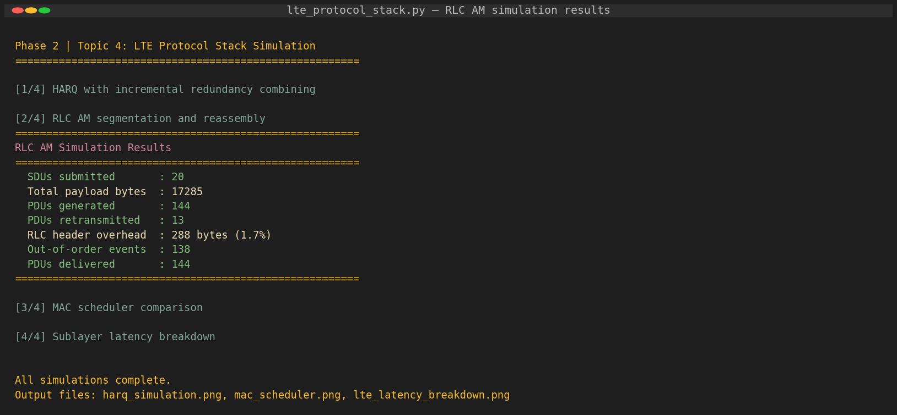
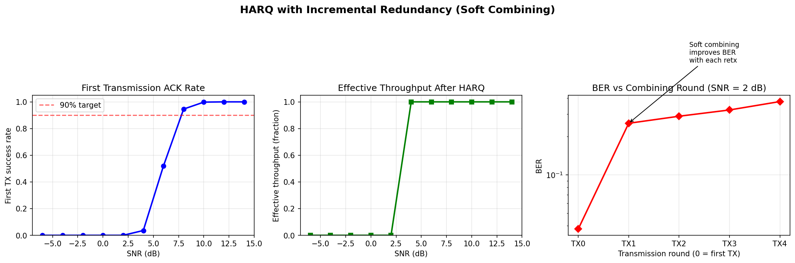
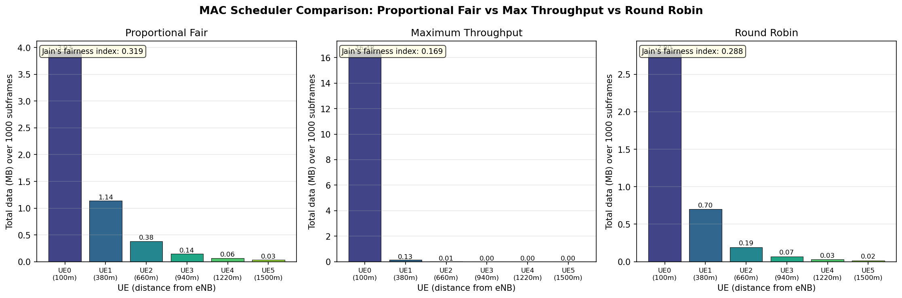
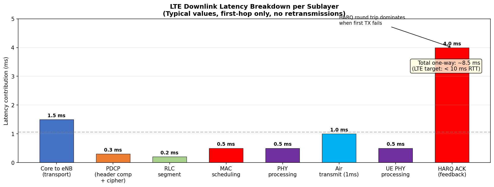
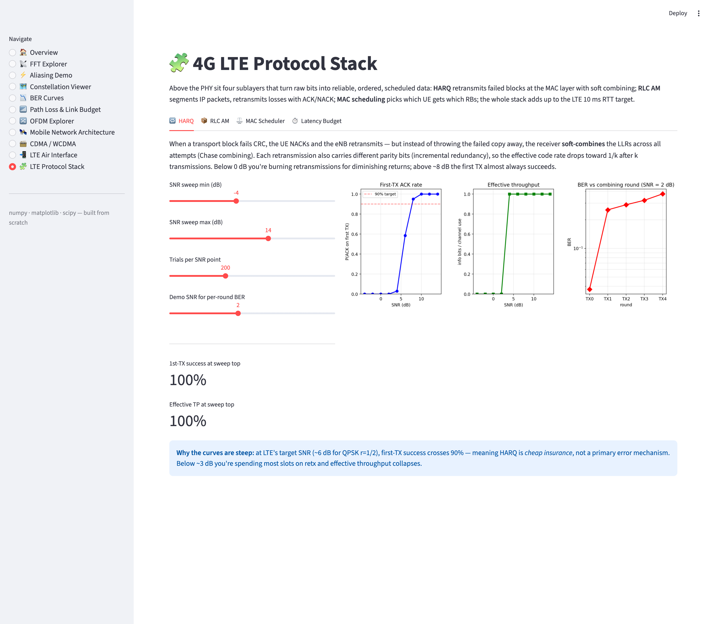
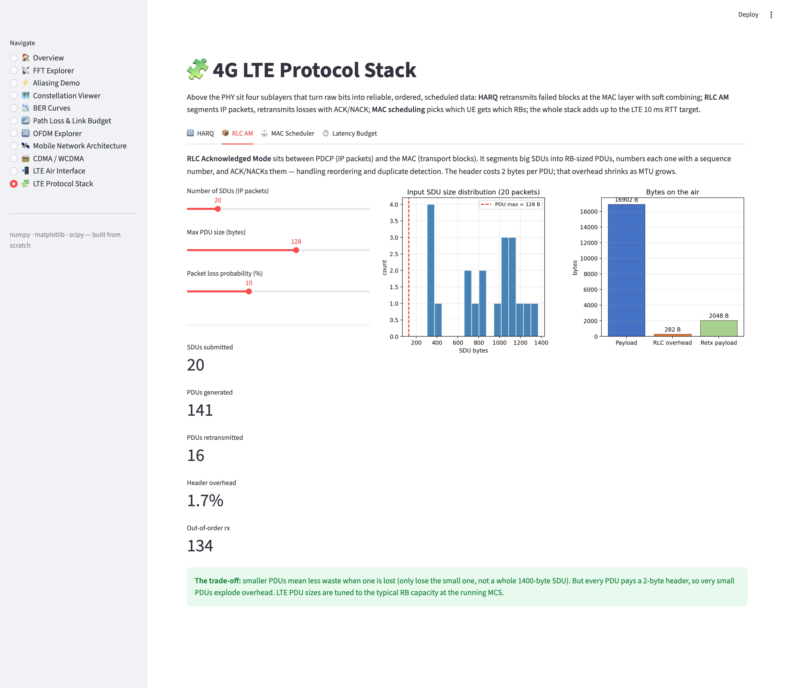
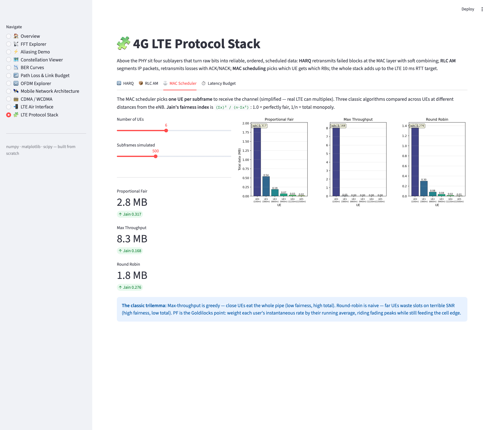
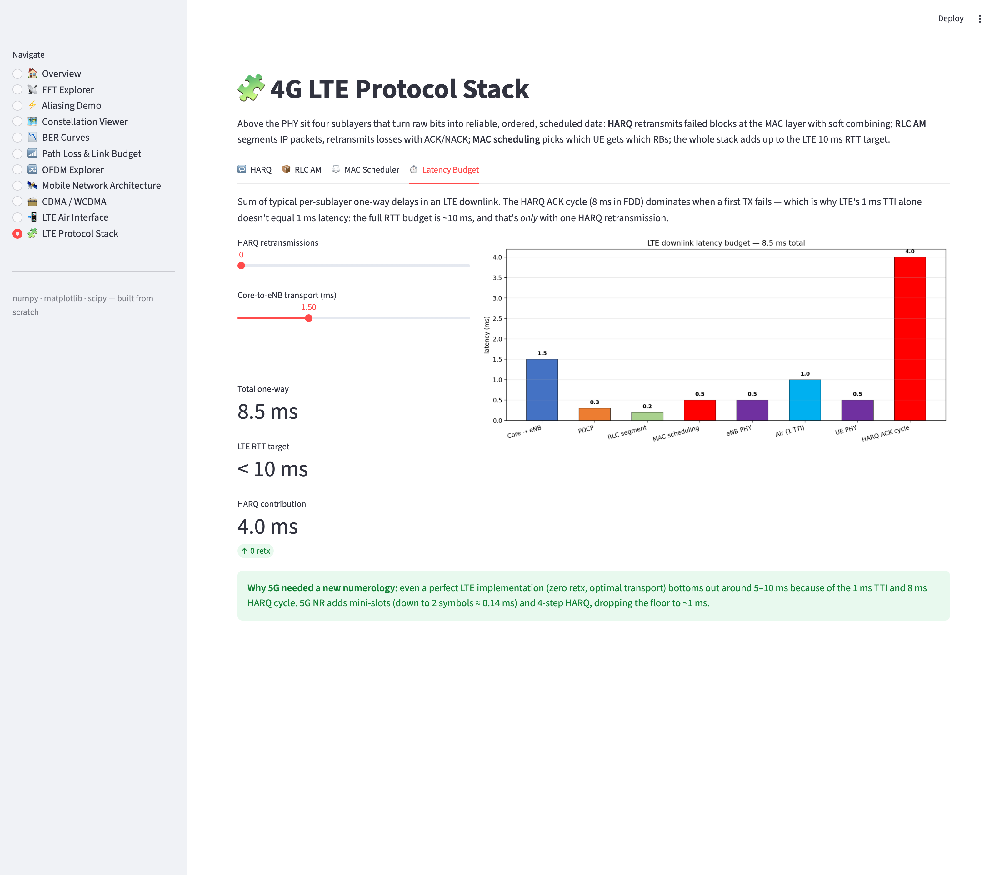

# 08 — 4G LTE Protocol Stack (Phase 2 · Topic 4)

Below IP and above the PHY sit four sublayers that turn raw radio bits into reliable, ordered, scheduled data: **HARQ** at the MAC layer retransmits failed transport blocks with soft combining; **RLC AM** segments IP packets and ACK/NACKs them; the **MAC scheduler** picks who gets the channel; and the whole stack has to fit into LTE's ~10 ms RTT budget.

## Files

| File | Purpose |
|------|---------|
| [`lte_protocol_stack.py`](lte_protocol_stack.py) | Simulators for HARQ, RLC AM, MAC scheduling, and latency budget |

## Run

```bash
python3 lte_protocol_stack.py
```

Outputs three plots — `harq_simulation.png`, `mac_scheduler.png`, `lte_latency_breakdown.png` — and prints the RLC AM statistics to stdout.

---

## Concepts

### 1. HARQ — Hybrid ARQ with soft combining

Two error-recovery mechanisms layered on top of each other:

- **Forward error correction** (turbo / LDPC at lower layers) — corrects most random bit errors before retx is ever needed.
- **Retransmission** when CRC still fails — but the receiver *does not throw away* the failed block. It stores the soft LLRs and combines them with the next attempt:

```
combined_LLR_k = LLR_0 + LLR_1 + ... + LLR_k    # Chase combining
```

Two flavours:

| Mode | What the retransmission carries |
|------|---------------------------------|
| Chase combining (CC) | Identical copy of the original code bits |
| Incremental redundancy (IR) | Different parity bits each time → effective code rate drops |

LTE uses **IR**: redundancy version 0 is mostly systematic + a little parity; RVs 1, 2, 3 carry progressively more parity. After k transmissions the receiver effectively sees a rate `≈ 1/(k+1)` code.

The simulator sweeps SNR from −6 to +14 dB and shows:
- 1st-TX success crosses 90% around 6–8 dB
- Effective throughput collapses below 3 dB (most slots spent on retx)
- BER drops monotonically with each combined round

### 2. RLC Acknowledged Mode

```
PDCP SDU (IP packet, 200–1400 B)
        │
        ▼  segment into max_pdu_bytes chunks
RLC PDUs (each + 2 B header with sequence number)
        │
        ▼  MAC schedules onto RBs
        │
        ▼  air interface (lossy + reorderable)
        │
RLC Rx: reorder by SN, deliver in-order, NACK gaps
```

Key responsibilities of RLC AM:
- **Segmentation** — fit any-size SDU into RB-sized PDUs
- **Sequence numbering** — 10-bit SN by default (1024-entry window)
- **In-order delivery** — buffer out-of-order PDUs until the gap fills
- **ARQ** — NACK lost PDUs, retransmit on request
- **Duplicate detection** — drop PDUs below `next_expected_sn`

The simulator runs 20 random IP packets (200–1400 B), segments into 128-byte PDUs, drops 10% on the air, and shuffles 5% out of order. Typical result: ~140 PDUs, **~1.7% header overhead**, all SDUs reassembled even after retransmissions.

### 3. MAC scheduling — the classic trilemma

Three algorithms picking which UE gets the channel each subframe:

| Algorithm | Metric | Effect |
|-----------|--------|--------|
| **Max throughput** | `argmax R_inst(u)` | Close-in UE eats the pipe → high total, terrible fairness |
| **Round robin**    | `sf % n_ue` | Every UE in turn, ignoring channel quality → high fairness, low total (far UEs waste slots) |
| **Proportional fair** | `argmax R_inst(u) / R_avg(u)` | Each UE wins on RBs where they're temporarily strong relative to their running average → rides fading peaks while still feeding the edge |

**Jain's fairness index** `J = (Σxᵢ)² / (n · Σxᵢ²)` quantifies this — 1.0 = perfectly fair, 1/n = single-user monopoly.

### 4. Latency budget

| Sublayer / event | Typical one-way (ms) |
|------------------|----------------------|
| Core → eNB transport | 1.5 |
| PDCP (header comp + cipher) | 0.3 |
| RLC segmentation | 0.2 |
| MAC scheduling | 0.5 |
| eNB PHY processing | 0.5 |
| Air interface (1 TTI) | 1.0 |
| UE PHY processing | 0.5 |
| HARQ ACK cycle (FDD) | 4.0 (+8 per retx) |
| **Total (zero retx)** | **~8.5** |

LTE targeted **<10 ms RTT** — and the 8 ms HARQ cycle alone means even an otherwise-perfect stack can't go much lower. 5G NR's mini-slot numerology + 4-step HARQ is specifically what drops that floor toward 1 ms.

---

## Output (script run)

### Console summary



### HARQ plots



### MAC scheduler comparison



### LTE latency breakdown



---

## Interactive dashboard

The same simulators are also explorable in [`../app.py`](../app.py) under the **🧩 LTE Protocol Stack** page. Four tabs:

### 1. HARQ
Sweep SNR, pick trials/point, and watch per-round BER drop as soft-combining adds redundancy.



### 2. RLC AM
Tune SDU count, max PDU size, and packet-loss probability — see overhead %, retx count, and bytes accounting update live.



### 3. MAC Scheduler
Side-by-side PF / max-throughput / round-robin bars with Jain's index in each pane.



### 4. Latency Budget
Add HARQ retransmissions, tune backhaul latency — see the total RTT walk past the 10 ms target.



```bash
streamlit run ../app.py
```

---

## Key formulas

| Formula | Meaning |
|---------|---------|
| `LLR_k = 2·r_k / σ²` | Per-bit Log-Likelihood Ratio from AWGN sample |
| `combined_LLR = Σ LLR_k` | Chase / MRC soft combining across HARQ rounds |
| `effective_rate = 1 / (avg_retx + 1)` | Info bits per channel use after HARQ |
| `metric_PF = R_inst(u) / R_avg(u)` | Proportional-fair scheduler metric |
| `J = (Σ xᵢ)² / (n · Σ xᵢ²)` | Jain's fairness index (1 = perfectly fair) |
| `RTT ≈ TTI + 2·(PHY+MAC+RLC+PDCP) + HARQ_cycle` | LTE round-trip-time budget |
