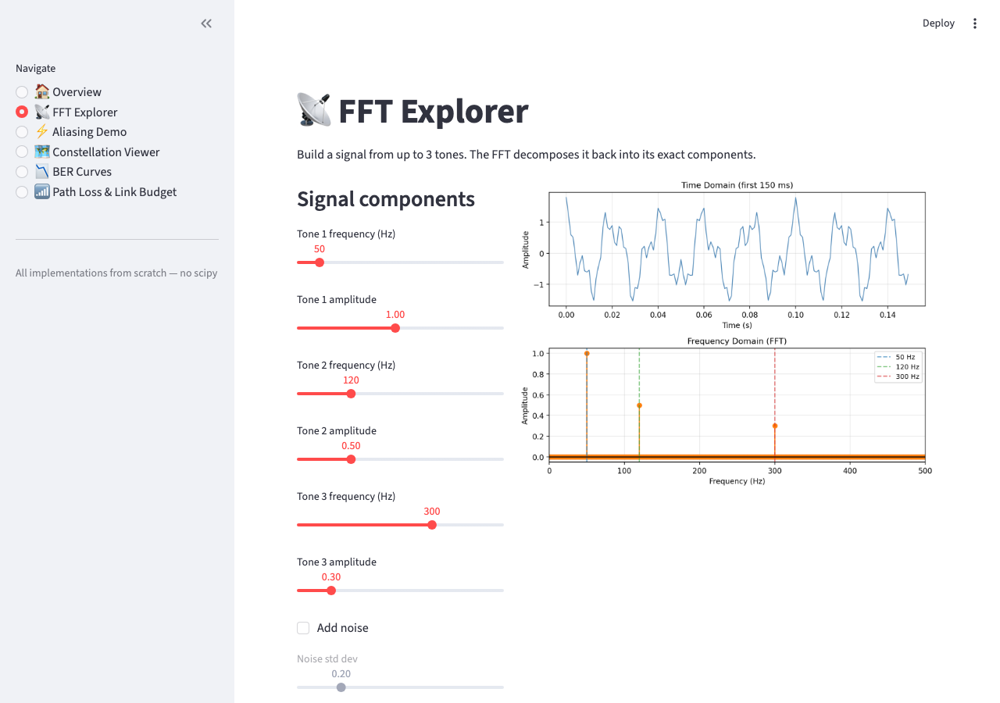
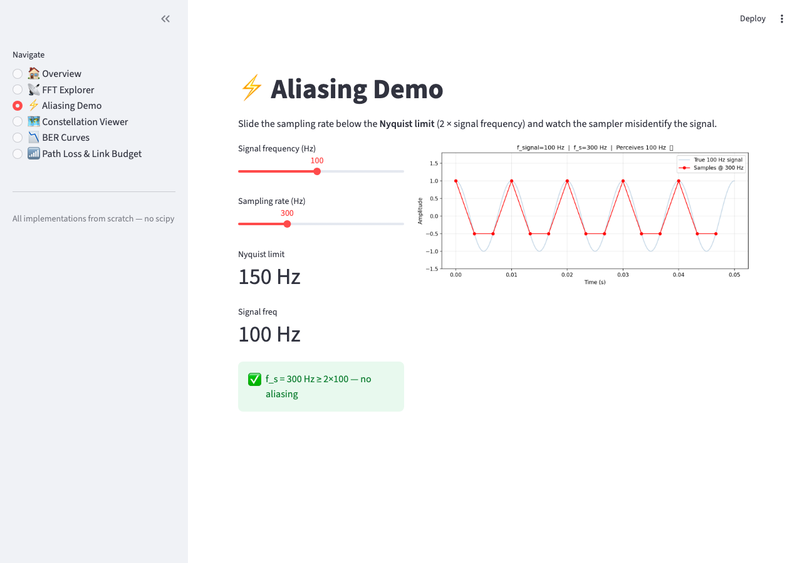
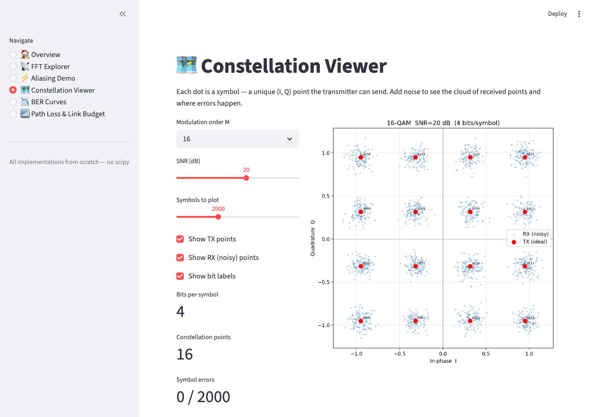
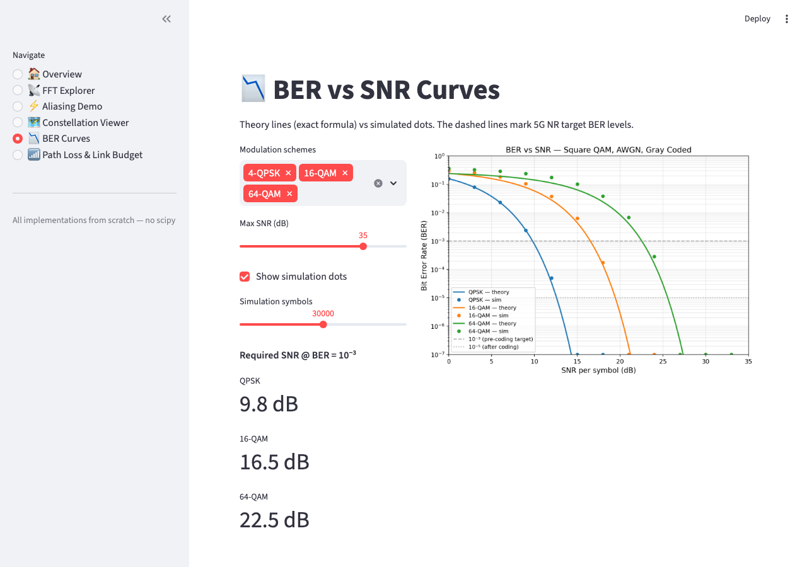
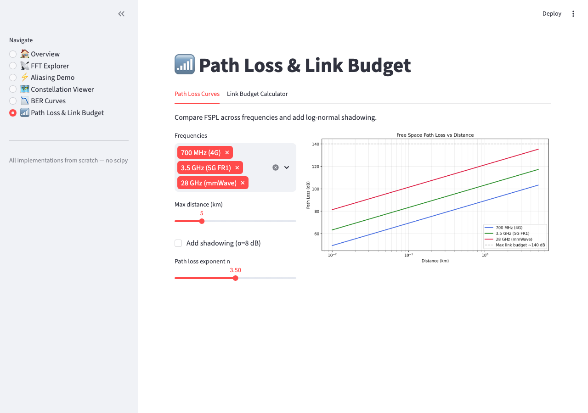
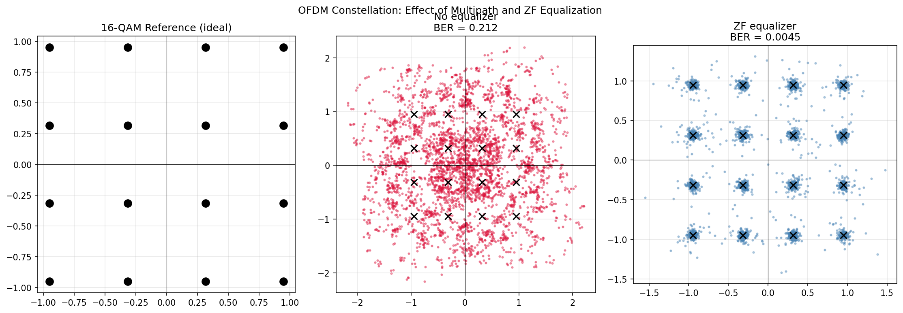
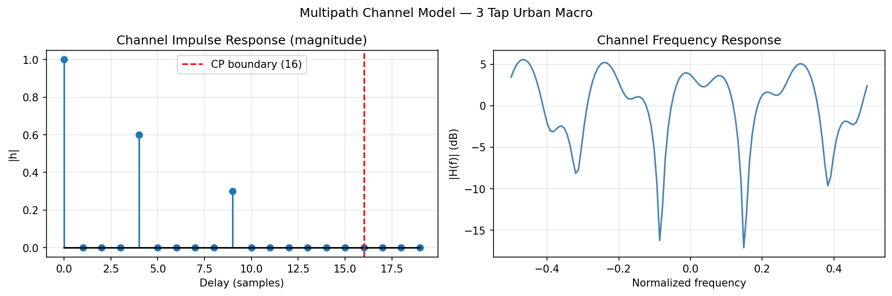
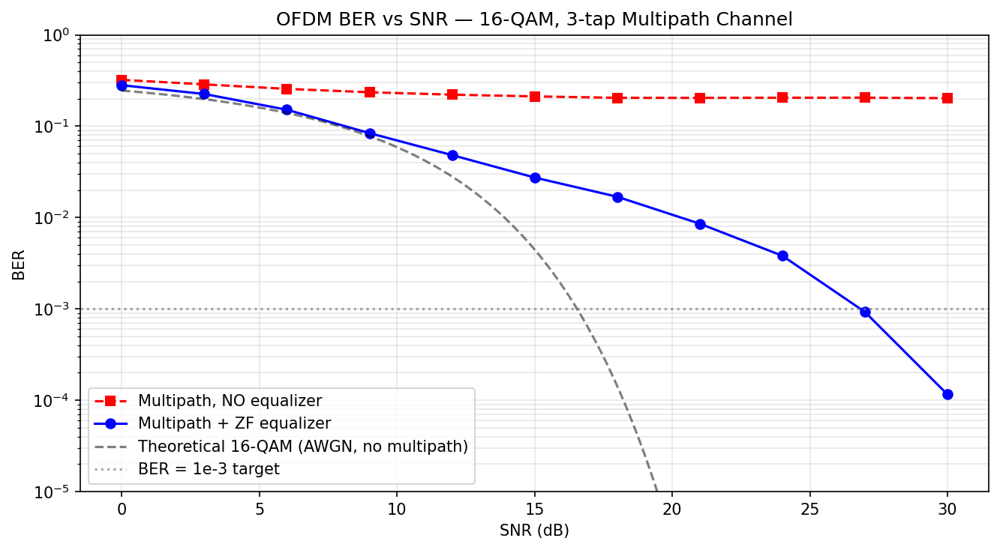

# Wireless Communication Principles

A topic-wise organized reference and implementation repo for core wireless communication concepts — from networking fundamentals through 5G NR.

---

## Interactive Dashboard

```bash
pip install streamlit numpy matplotlib scipy
streamlit run app.py
```


| Page | What you can do |
|------|-----------------|
| 🏠 Overview | Summary of all pages |
| 📡 FFT Explorer | Build a composite signal from up to 3 tones, see live spectrum |
| ⚡ Aliasing Demo | Drag sampling rate below Nyquist and watch aliasing happen |
| 🗺️ Constellation Viewer | Pick modulation order, add AWGN noise, watch symbols scatter |
| 📉 BER Curves | Theory vs Monte Carlo — how SNR drives error rate |
| 📶 Path Loss & Link Budget | Tune distance / frequency / antenna gains — PASS or FAIL |
| 🔀 OFDM Explorer | Build a multipath channel, equalize it, measure BER vs SNR |

### Dashboard screenshots

| FFT Explorer | Aliasing Demo |
|---|---|
|  |  |

| Constellation Viewer | BER Curves |
|---|---|
|  |  |

| Path Loss | OFDM — Constellation |
|---|---|
|  |  |

---

## Tech Stack


| Layer | Tool | Purpose |
|-------|------|---------|
| Language | Python 3.10+ | All implementations |
| Numerics | NumPy | Signal processing, matrix ops, FFT |
| Plotting | Matplotlib | All static plots and figures |
| Dashboard | Streamlit | Interactive visualizations (`app.py`) |
| DSP | Pure NumPy | FIR design, STFT, OFDM modulator — built from scratch |
| Theory | SciPy | `erfc` for theoretical BER reference curves |
| Version control | Git + GitHub | This repo |

All signal processing is built from scratch with NumPy — no black-box DSP functions. SciPy is used only for the `erfc` function in theoretical BER formulas.

---

## Structure

| Folder | Topic | Key files |
|--------|-------|-----------|
| [00_Networking_Fundamentals](00_Networking_Fundamentals/) | TCP/UDP, packet switching, 4 delays, encapsulation | `delay_calculator.py` `tcp_demo.py` `udp_demo.py` |
| [01_Signal_Fundamentals](01_Signal_Fundamentals/) | RF basics, dB/dBm, path loss models, link budget | `rf_basics.py` `path_loss.py` `link_budget.py` |
| [02_Modulation_Techniques](02_Modulation_Techniques/) | QAM constellations, BER curves, 5G MCS table | `constellation.py` `transceiver.py` `ber_curves.py` `mcs_table.py` |
| [03_DSP](03_DSP/) | FFT, Nyquist/aliasing, FIR filter, spectrogram | `fft_basics.py` `aliasing.py` `fir_filter.py` `spectrogram.py` |
| [03_Channel_Models](03_Channel_Models/) | AWGN, Rayleigh/Rician fading *(coming soon)* | — |
| [04_OFDM](04_OFDM/) | Full transceiver, multipath channel, ZF equalizer, BER vs SNR | `ofdm_transceiver.py` |
| [05_MIMO](05_MIMO/) | Spatial multiplexing, beamforming *(coming soon)* | — |
| [06_Error_Coding](06_Error_Coding/) | Hamming, LDPC, polar codes *(coming soon)* | — |
| [07_Multiple_Access](07_Multiple_Access/) | CDMA, OFDMA, NOMA *(coming soon)* | — |
| [08_5G_NR](08_5G_NR/) | NR numerology, mmWave, massive MIMO *(coming soon)* | — |
| [09_Link_Budget](09_Link_Budget/) | End-to-end SNR/BER/margin *(coming soon)* | — |
| [10_Simulations](10_Simulations/) | End-to-end chain *(coming soon)* | — |

---

## Topic 5 — OFDM Full Transceiver

The [04_OFDM/](04_OFDM/) module implements a complete OFDM link with a 5G NR-like parameter set (128-point FFT, 72 active subcarriers, 16-sample cyclic prefix).

**Simulation results** (16-QAM, 3-tap urban macro channel):

| SNR (dB) | BER — ZF equalizer | BER — no equalizer |
|----------|--------------------|--------------------|
| 12 | 4.83e-02 | 2.21e-01 |
| 18 | 1.69e-02 | 2.05e-01 |
| 24 | 3.82e-03 | 2.05e-01 |
| 27 | 9.26e-04 | 2.05e-01 |
| 30 | 1.16e-04 | 2.03e-01 |

Without equalization the BER **floors at ~0.20** regardless of SNR — channel distortion is deterministic and power doesn't fix it. The ZF equalizer crosses the 10⁻³ target at **≈27 dB**, tracking close to the theoretical AWGN curve.

| Channel model | BER vs SNR curve |
|---|---|
|  |  |

---

## Goals
- Implement every concept from scratch — no black-box libraries
- Connect theory (formulas) to simulation (code) to visualization (plots)
- Build intuition for system-level 5G design
