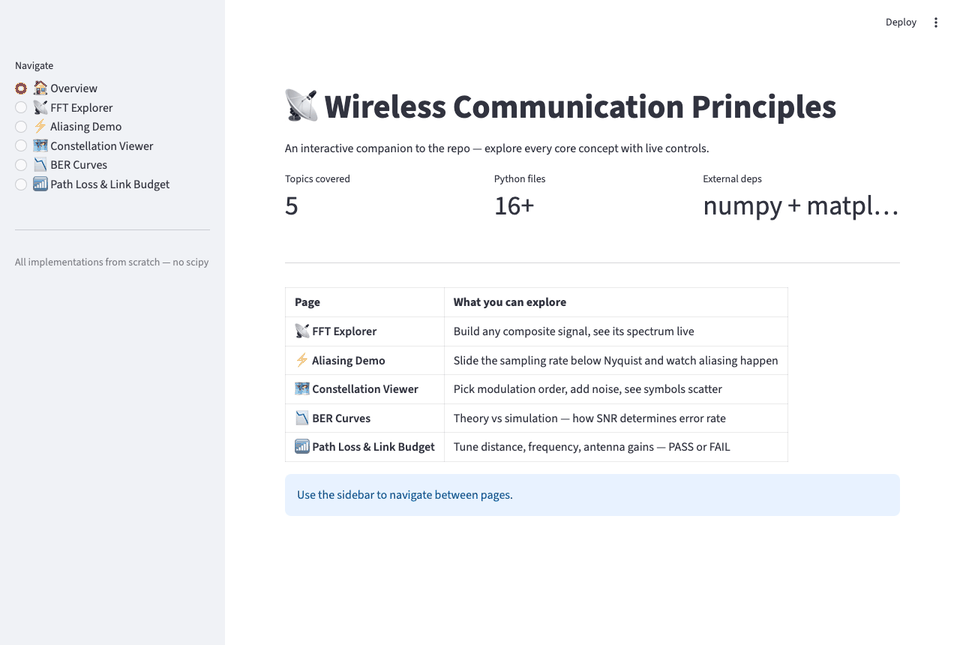

# Wireless Communication Principles

A topic-wise organized reference and implementation repo for core wireless communication concepts — from networking fundamentals through 5G NR.

---

## Interactive Dashboard

```bash
pip install streamlit numpy matplotlib
streamlit run app.py
```



---

## Tech Stack


| Layer | Tool | Purpose |
|-------|------|---------|
| Language | Python 3.10+ | All implementations |
| Numerics | NumPy | Signal processing, matrix ops, FFT |
| Plotting | Matplotlib | All static plots and figures |
| Dashboard | Streamlit | Interactive visualizations (`app.py`) |
| DSP | Pure NumPy | FIR design, STFT — no scipy needed |
| Version control | Git + GitHub | This repo |

No external DSP libraries — everything (FIR filter, STFT, BER simulation, constellation generation) is built from scratch using NumPy so the internals are fully visible.

---

## Structure

| Folder | Topic | Key files |
|--------|-------|-----------|
| [00_Networking_Fundamentals](00_Networking_Fundamentals/) | TCP/UDP, packet switching, 4 delays, encapsulation | `delay_calculator.py` `tcp_demo.py` `udp_demo.py` |
| [01_Signal_Fundamentals](01_Signal_Fundamentals/) | RF basics, dB/dBm, path loss models, link budget | `rf_basics.py` `path_loss.py` `link_budget.py` |
| [02_Modulation_Techniques](02_Modulation_Techniques/) | QAM constellations, BER curves, 5G MCS table | `constellation.py` `transceiver.py` `ber_curves.py` `mcs_table.py` |
| [03_DSP](03_DSP/) | FFT, Nyquist/aliasing, FIR filter, spectrogram | `fft_basics.py` `aliasing.py` `fir_filter.py` `spectrogram.py` |
| [03_Channel_Models](03_Channel_Models/) | AWGN, Rayleigh/Rician fading *(coming soon)* | — |
| [04_OFDM](04_OFDM/) | Cyclic prefix, subcarriers, IFFT/FFT, PAPR *(coming soon)* | — |
| [05_MIMO](05_MIMO/) | Spatial multiplexing, beamforming *(coming soon)* | — |
| [06_Error_Coding](06_Error_Coding/) | Hamming, LDPC, polar codes *(coming soon)* | — |
| [07_Multiple_Access](07_Multiple_Access/) | CDMA, OFDMA, NOMA *(coming soon)* | — |
| [08_5G_NR](08_5G_NR/) | NR numerology, mmWave, massive MIMO *(coming soon)* | — |
| [09_Link_Budget](09_Link_Budget/) | End-to-end SNR/BER/margin *(coming soon)* | — |
| [10_Simulations](10_Simulations/) | End-to-end chain *(coming soon)* | — |

---

## Goals
- Implement every concept from scratch — no black-box libraries
- Connect theory (formulas) to simulation (code) to visualization (plots)
- Build intuition for system-level 5G design
